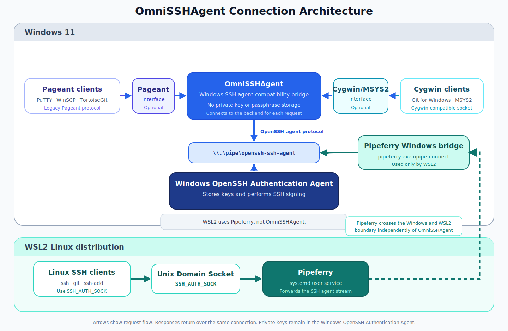

# OmniSSHAgent

> [!IMPORTANT]
> **Upgrading from an earlier version of OmniSSHAgent?**
>
> OmniSSHAgent has been redesigned around the Windows OpenSSH agent. Its role,
> configuration, and WSL integration have changed. Before upgrading, read
> [Why OmniSSHAgent Is Being Redesigned](docs/why-omnisshagent-is-being-redesigned.md)
> and follow the [legacy migration guide](docs/migration-from-legacy.md).

OmniSSHAgent reduces the fragmented SSH agent environment on Windows.

Windows applications use several incompatible SSH agent interfaces. Native
OpenSSH clients use a Windows Named Pipe, PuTTY-family applications use the
Pageant protocol, and Git for Windows, MSYS2, and Cygwin use a Cygwin-compatible
socket format.

OmniSSHAgent connects these Windows client interfaces to the Windows OpenSSH
Authentication Agent. It runs as a Windows 11 notification-area application and
does not store private keys or passphrases itself.

## Architecture



The Windows OpenSSH Authentication Agent remains responsible for private key
storage and signing operations.

OmniSSHAgent opens `\\.\pipe\openssh-ssh-agent` for each request and exposes two
optional compatibility interfaces:

- Pageant for PuTTY, WinSCP, TortoiseGit, and other Pageant-compatible clients
- Cygwin/MSYS2 for Git for Windows, MSYS2, and Cygwin clients

WSL2 does not connect through OmniSSHAgent. WSL integration is provided
separately by [Pipeferry](https://github.com/masahide/pipeferry/blob/main/docs/openssh-agent.md),
which connects a Unix Domain Socket in WSL2 to the same Windows OpenSSH Named
Pipe.

## Design goals

OmniSSHAgent is intentionally focused on compatibility rather than key
management.

- Use the Windows OpenSSH Authentication Agent as the default backend
- Avoid replacing or disabling the Windows standard SSH agent
- Make existing Pageant and Cygwin/MSYS2 clients use the same backend keys
- Keep Pageant and Cygwin/MSYS2 failures isolated from each other
- Recover automatically after the backend agent is restarted
- Avoid storing private keys, passphrases, or SSH agent payloads
- Keep WSL2 transport independent through Pipeferry
- Remain a small Windows-native notification-area application

For the background and rationale behind this redesign, see
[Why OmniSSHAgent Is Being Redesigned](docs/why-omnisshagent-is-being-redesigned.md).

## Requirements

- Windows 11
- x86-64
- Windows OpenSSH Authentication Agent

Windows 10, Windows on ARM, macOS, Linux, and WSL1 are not supported by the
current MVP.

## Prepare the Windows OpenSSH agent

Start the Windows OpenSSH Authentication Agent and add your keys before using
OmniSSHAgent.

Open PowerShell as Administrator and configure the service:

```powershell
Set-Service ssh-agent -StartupType Automatic
Start-Service ssh-agent
```

Check the service and add a key:

```powershell
Get-Service ssh-agent
ssh-add
ssh-add -l
```

OmniSSHAgent connects to `\\.\pipe\openssh-ssh-agent` for each individual
request. If the OpenSSH agent is stopped and later restarted, OmniSSHAgent can
recover without being restarted.

## Install

Open Windows PowerShell or PowerShell 7. Do not use Command Prompt or Git Bash
for the installer command.

Confirm the current shell:

```powershell
(Get-Process -Id $PID).ProcessName
```

The command must return `powershell` or `pwsh`.

Install OmniSSHAgent:

```powershell
irm https://raw.githubusercontent.com/masahide/OmniSSHAgent/main/install.ps1 | iex
```

Administrator privileges are not required. The installer:

- Downloads the latest Windows x86-64 release
- Verifies its SHA-256 checksum
- Installs it under `%LOCALAPPDATA%\Programs\OmniSSHAgent`
- Creates a Start menu shortcut
- Starts the notification-area application

Run the same command again to update. The installer asks a running
OmniSSHAgent process to shut down cleanly, replaces the executable, and starts
the new version.

## First run and notification-area menu

The first run creates:

```text
%APPDATA%\OmniSSHAgent\config.toml
```

The notification-area menu provides:

- Current application state
- Pageant interface enable or disable setting
- Cygwin/MSYS2 interface enable or disable setting
- Start with Windows setting
- Open configuration
- Open configuration directory
- Open log directory
- Quit

The **Start with Windows** setting registers OmniSSHAgent for the current user
and does not require administrator privileges.

Changes made directly to `config.toml` take effect after OmniSSHAgent is
restarted. Pageant and Cygwin/MSYS2 enable settings can also be changed from the
notification-area menu.

## Client setup

### Pageant-compatible applications

Start OmniSSHAgent before launching applications that expect Pageant.

Supported examples include:

- PuTTY
- WinSCP
- TortoiseGit

These applications can use keys loaded in the Windows OpenSSH Authentication
Agent through OmniSSHAgent's Pageant compatibility interface.

Only one application can own the Pageant window class. Stop another Pageant
implementation if it conflicts with OmniSSHAgent.

### Git for Windows, MSYS2, and Cygwin

OmniSSHAgent creates a Cygwin-compatible socket descriptor. The default Windows
path is:

```text
%USERPROFILE%\.ssh\omnisshagent-cygwin.sock
```

In Git Bash or MSYS2, set `SSH_AUTH_SOCK` to its Unix-style path:

```bash
export SSH_AUTH_SOCK="$(cygpath -u "$USERPROFILE/.ssh/omnisshagent-cygwin.sock")"
ssh-add -l
```

Add the `export` command to the appropriate shell startup file when you want it
to apply to new shells automatically.

## WSL2 through Pipeferry

OmniSSHAgent no longer includes WSL proxy commands, WSL Unix Domain Socket
management, or PowerShell Named Pipe proxy scripts.

Use Pipeferry for WSL2:

```bash
curl -fsSL https://raw.githubusercontent.com/masahide/pipeferry/main/install-ssh-agent.sh | sh
```

Pipeferry installs a systemd user service in WSL2 and provides shell environment
files for `SSH_AUTH_SOCK`.

See the complete setup and diagnostics guide:

- [Use the Windows OpenSSH Agent from WSL with Pipeferry](https://github.com/masahide/pipeferry/blob/main/docs/openssh-agent.md)

## Configuration

The default configuration file is:

```text
%APPDATA%\OmniSSHAgent\config.toml
```

Default configuration:

```toml
version = 1

[backend]
type = "windows-openssh"
pipe = "openssh-ssh-agent"
connect_timeout = "5s"

[interfaces.pageant]
enabled = true

[interfaces.cygwin]
enabled = true
socket_path = ""

[tray]
show_sign_notifications = false

[logging]
level = "info"
```

Unknown fields and unsupported configuration versions are rejected instead of
being silently ignored.

See [configuration](docs/configuration.md) for all available settings.

## Diagnostics

The console executable provides diagnostic commands:

```powershell
OmniSSHAgent-console.exe version
OmniSSHAgent-console.exe config-path
OmniSSHAgent-console.exe check-config
OmniSSHAgent-console.exe check-config --config C:\path\to\config.toml
```

Logs are written under:

```text
%LOCALAPPDATA%\OmniSSHAgent\logs
```

See [testing and troubleshooting](docs/testing.md) for service checks, socket
checks, Pageant conflicts, and log interpretation.

## Application states

OmniSSHAgent reports one of the following states in the notification area.

### Running

The configuration is valid and all enabled compatibility interfaces started
successfully.

### Degraded

The configuration is valid, but one compatibility interface could not start.
For example, another Pageant implementation may already own the Pageant window
class while the Cygwin/MSYS2 interface remains usable.

### Configuration error

The configuration file is invalid. Compatibility interfaces are not started,
but the notification-area menu remains available so the configuration and logs
can be opened.

## Security model

OmniSSHAgent is a protocol bridge and does not act as an independent key store.

- Private keys remain in the configured OpenSSH-compatible backend
- Passphrases are not stored by OmniSSHAgent
- SSH agent request and signing payloads are not written to logs
- The Cygwin-compatible TCP listener binds only to `127.0.0.1`
- Cygwin connections require the socket descriptor nonce handshake
- Pageant shared-memory sizes and SSH agent message lengths are validated
- Interfaces are isolated so one listener failure does not stop unrelated ones

## Build from source

Go 1.25.6 is required.

```powershell
go build -trimpath -o OmniSSHAgent-console.exe ./cmd/omnisshagent
go build -trimpath -ldflags="-H=windowsgui" -o OmniSSHAgent.exe ./cmd/omnisshagent
.\OmniSSHAgent.exe
```

See [development](docs/development.md) for repository structure, tests, and
Windows-specific implementation notes.

## Uninstall

Open Windows PowerShell or PowerShell 7 and confirm the current shell:

```powershell
(Get-Process -Id $PID).ProcessName
```

Then run:

```powershell
irm https://raw.githubusercontent.com/masahide/OmniSSHAgent/main/uninstall.ps1 | iex
```

The uninstaller:

- Stops an installed OmniSSHAgent process
- Removes its Start with Windows registration
- Removes the installed application

Configuration and logs are retained. Remove these directories manually when
they are no longer needed:

```text
%APPDATA%\OmniSSHAgent
%LOCALAPPDATA%\OmniSSHAgent
```

## Migration from earlier versions

Earlier OmniSSHAgent versions could load private key files directly, store
passphrases in Windows Credential Manager, replace the Windows OpenSSH Named
Pipe, and provide WSL proxy functionality.

The redesigned version instead uses the Windows OpenSSH Authentication Agent as
the backend and delegates WSL2 integration to Pipeferry.

Before upgrading, read:

- [Why OmniSSHAgent Is Being Redesigned](docs/why-omnisshagent-is-being-redesigned.md)
- [Legacy migration guide](docs/migration-from-legacy.md)

## Known limitations

The current MVP does not provide:

- A key-management GUI
- Direct private key file loading
- Configuration hot reload
- Automatic updates inside the application
- Authenticode signing
- Log retention or size-based cleanup
- Windows 10 or ARM64 support

## Related documentation

- [Configuration](docs/configuration.md)
- [Testing and troubleshooting](docs/testing.md)
- [Development](docs/development.md)
- [Why OmniSSHAgent Is Being Redesigned](docs/why-omnisshagent-is-being-redesigned.md)
- [Legacy migration guide](docs/migration-from-legacy.md)
- [Pipeferry OpenSSH Agent integration](https://github.com/masahide/pipeferry/blob/main/docs/openssh-agent.md)
