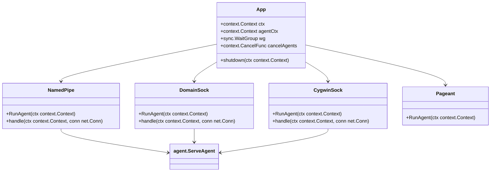
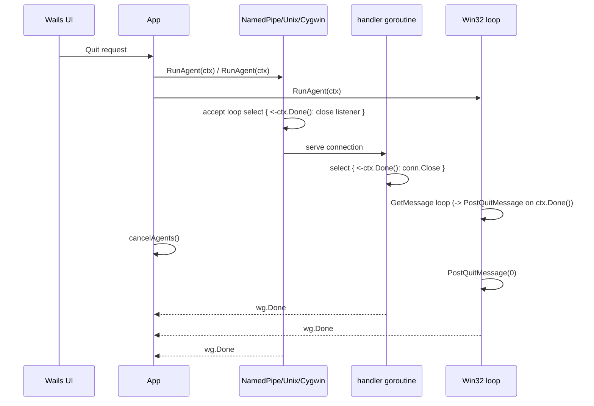

# Agent Shutdown Cancellation Plan

## 1. 概要と目的 Overview and Purpose
- What  `App.shutdown` 時点で生成済みエージェント goroutine にキャンセルを伝搬し、すべての `RunAgent` と接続ハンドラが確実に終了するようにする。これには `context.Context` を各エージェントに注入し、リスナーやループがキャンセルを監視してソケットを閉じる仕組みを追加する。
- Why  現在の `Quit` 操作で `wg.Wait` が永遠にブロックし、goroutine が蓄積してプロセス全体がハングするため、シャットダウン時にリソースリーク／ハングしない安定したアプリケーション状態を保証する。クリティカルな不具合修正。
- How  `App` が `context.WithCancel` で生成する `context.Context` を `pageant`, `namedpipe`, `unix`, `cygwinsocket` の `RunAgent` に渡し、`select` でキャンセルを監視して `Listener` や `Accept` を中断する。接続ハンドラでも `context` を共有してエージェントの `agent.ServeAgent` を終了させ、`sync.WaitGroup` を `App` に再集約する。

## 2. 仕様と受け入れ条件 Specification and Acceptance Criteria

### 2.1 スコープ Scope
- `App` から派生する各 `RunAgent` と接続ハンドラ（Pageant の Win32 メッセージループ、NamedPipe/UnixSocket/Cygwin の `Accept`/`ServeAgent`）で `context.Context` を受け取り、キャンセル時にすべてのリスナーや接続を閉じる。
- `App.shutdown` で `CancelFunc` を呼び出した後、`waitGroup` がすべての goroutine を待機できる状態にする。
- Goroutine を監視するテスト・ロギングを追加して、キャンセルが正しく作用していることを示す。

### 2.2 非スコープ Non Scope
- プロキシ・NamedPipe ロジックの根本的な再設計や UI 側の変更。
- 各エージェント内部での接続数制限やタイムアウト強化（現状の ReadDeadline までは維持）。

### 2.3 ユースケース Use Cases
1. 正常系: ユーザーが「Quit」メニューを選択 → `App.shutdown` が `CancelFunc` を呼び出す → `RunAgent` は `context.Done()` を受けてリスナーを閉じて `wg.Done()` → アプリケーションがすぐに終了する。
2. 異常系: `agent.ServeAgent` が長時間ブロック中でも `CancelFunc` で接続ハンドラの `ServeAgent` がキャンセルされ、goroutine が残らず `wg.Wait` を通過する。
3. 長時間稼働: 何百の接続を処理した後 `Quit` しても直ちにすべての goroutine が終了し、ソケットがリリースされる。

### 2.4 受け入れ条件 Acceptance Criteria
- Given App が複数の NamedPipe/Unix/Cygwin エージェントを起動し、When `quit` を選択して `shutdown` を呼ぶと Then `context.CancelFunc` が呼ばれすべての `RunAgent` が `wg.Done` して `wg.Wait` を抜ける（ログでキャンセル確認）。
- Given `agent.ServeAgent` が接続ハンドラ内でブロックしている状態で When キャンセルが到達すると Then ハンドラ goroutine は `ServeAgent` を退避し、`waitGroup` がゼロになる。
- Given Pageant の Win32 メッセージループが `GetMessage` を待っているとき When `CancelFunc` で `PostQuitMessage` が送られると Then `RunAgent` 関数はループを抜け `wg.Done` する。
- Given NamedPipe/Unix/Cygwin 各エージェントの `Accept` ループに新しい接続がない間 When `CancelFunc` がキャンセルされると Then listener が `Close` され `Accept` がエラーで復帰してループを抜ける。
- Given すべてのエージェント goroutine が終了したとき When `App.shutdown` が完了すると Then `Quit` のログ出力の直後にプロセスが終了する（blocking しない）。

### 2.5 既知の制約 Known Limitations
- `agent.ServeAgent` は `Context` を直接受け取らないため、接続ハンドラで `Close(conn)` することでキャンセルを強制するが、`ServeAgent` 内での任意処理にタイムアウトや即時停止保証はない。
- Win32 API 周りは `PostQuitMessage` でキャンセルする前提となるため、微妙な race 条件が残るかもしれないが許容される。

## 3. 前提技術スタック Context and Tech Stack
- Language Framework  Go 1.22 Wails 2（既存コードベース）
- Libraries  `golang.org/x/crypto/ssh/agent`, `github.com/masahide/OmniSSHAgent/pkg/*`
- Style Guide  既存の gofmt 整形、タブベースインデントを維持
- Runtime Deployment  Windows/Unix デスクトップバイナリ（Wails）
- Testing  `go test ./...`, 可能であれば `go test ./pkg/sshutil` などでユニットテストを追加

## 4. インターフェース契約 Interface Contracts

### 4.1 公開APIまたは外部I O一覧
- UI (Wails) は変更なし。Cancel は `shutdown` から `context.WithCancel` 経由で内部のみで伝搬。
- `App` から `pkg/*` 以下の `RunAgent` メソッドに `context.Context` 引数を追加（既存呼び出しは `app.go` のみ）。
- `agent.ServeAgent` への接続は `net.Conn` として管理し、`context.Done()` で `conn.Close()` を呼ぶ。

### 4.2 データモデルとスキーマ
- 特定のデータモデル変更なし。`context.Context` を引数に追加するだけで既存構造体 `DomainSock`, `NamedPipe`, `CygwinSock` には 0 個以上のフィールド変更を許容し、`extendedAgentWrapper` への影響はなし。

### 4.3 エラーと例外 Error Handling
- `context` キャンセルに伴う `Accept` のエラーは `net.ErrClosed`/`syscall.EINVAL` などで生じるが、`RunAgent` はログに残して nil を返したうえで `wg.Done` する。
- `PostQuitMessage` 後の `GetMessage` エラーは同様にログレベルで `debug` とし、再起不能エラー（例: `Listener` 再作成失敗）は `log.Printf` で明示。
- ハンドラで `ServeAgent` が `io.EOF` 以外のエラーを返した場合は既存のログ出力を継続する。

### 4.4 代表的な例 Examples
1. NamedPipe エージェント: `app.go` で `namedpipe.NamedPipe.RunAgent(ctx)` を呼び出し、`Accept` ループは `select { case <-ctx.Done(): pipe.Close(); return }` を行う。
2. Cygwin エージェント: `context` により goroutine を終了させるため、`handle` メソッドは `defer conn.Close()` に加え `select` で `ctx.Done()` を監視して `ServeAgent` を打ち切る。
3. Pageant エージェント: `context` キャンセル時に `winapi.PostQuitMessage(0)` を呼び出し、`GetMessage` ループから復帰する。

## 5. アーキテクチャと設計図 Architecture and Diagrams
### 5.1 図の選択方針
複数のエージェントモジュールと `App` 間の責務が重要なので、Class Diagram と Shutdown シーケンス図を提供。

### 5.2 クラス図 Class Diagram

### 5.3 その他の図 Optional

The Accept/handler loops now rely on the shared `agentlistener.Serve` helper so every `RunAgent` closes its listener on `ctx.Done()` before the per-connection goroutines also watch the same context and close their `net.Conn`s.

## 6. テスト戦略 Test Strategy
### 6.1 テストの種類
- Unit  `app_test.go` などで、`App.shutdown` で `cancelAgents` 呼び出しと `wg` の Waiting を検証するため、`context.WithTimeout` を使ったモック `RunAgent` を注入。`NamedPipe` の `Accept` モックを `net.Pipe` で差し替えてキャンセル時に `net.ErrClosed` を発生させる。
- Integration  `pkg/namedpipe`/`pkg/unix`/`pkg/cygwinsocket` に対して `context` をキャンセルし、`listener.Accept` がエラーで抜けて `wg` を減らすことを確認するテスト。`agent.ServeAgent` は `net.Conn` モック（`io.Pipe`）で `io.EOF` を返すようにする。
- Contract  `app.go` から `RunAgent(ctx)` への `context` パススルーと、`shutdown` が `CancelFunc`→`wg.Wait` の順に呼ばれることを保証するテスト。

### 6.2 カバレッジ対象
- `context` キャンセルルート（`select` で `ctx.Done()` を受け取る条件分岐）。
- `listener.Close()` 後の `Accept` によるエラー処理（`net.ErrClosed`、`io.EOF`）。
- `agent.ServeAgent` の `ctx.Done()` で `conn.Close()` されるケース。

## 7. 実装タスクリスト Implementation Plan
### Phase 1 設計と準備
- [x] 要件と仕様の確定 受け入れ条件とのすり合わせ（`docs/plans/260124-s01-agent-shutdown-cancel.md`）
- [x] インターフェース契約の確定 `RunAgent(ctx context.Context)` による契約と例の追加（`app.go`, `pkg/*`）
- [x] Mermaid図の作成 更新（上記クラス図とシーケンス図）
- [x] インターフェース 型定義の作成 `NamedPipe.RunAgent(ctx)` などのシグネチャ変更
- [x] テスト基盤の確認 `go test ./pkg/namedpipe ./pkg/unix ./pkg/cygwinsocket`

### Phase 2 機能名A (Agent shutdown cancellation) の実装
- [x] Test コンテキストキャンセルを模した `TestAppShutdownCancelsAgents` を作成（`app_test.go`）
- [x] Impl `RunAgent` に `context` を渡し `Accept` ループで `ctx.Done()` を選択、`listener.Close()` で終了させる
- [x] Refactor `NamedPipe`, `DomainSock`, `CygwinSock` 共通パターンを抽出（`agentlistener.Serve` ヘルパーなど）
- [x] Integration `agent.ServeAgent` に接続後 `ctx` キャンセルで goroutine が抜けることを統合テスト化（`pkg/agentlistener/listener_test.go`）
- [x] Docs `App.shutdown` のキャンセル動作と `context` パラメータを README に追記

### Phase 3 機能名B (Pageant loop cancellation) の実装
- [x] Test Pageant の Win32 ループに `context` を注入したモックテストを用意
- [x] Impl `Pageant.RunAgent(ctx)` で `PostQuitMessage` を `ctx.Done()` で送る実装
- [x] Refactor `App.startup` で `context.WithCancel` を共有して `wg` と一緒に管理
- [x] Integration `App` を起動して `CancelFunc` 呼び出し後、`wg.Wait` まで到達する統合テスト
- [x] Docs 変更点を `doc/dev/` や `AGENTS.md` に追記

### Phase 4 統合と検証
- [x] 全体テストの実行 `go test ./...`
- [x] エッジケースの動作確認 `Ctrl+C`/`Quit` 後のソケットクローズ（`agentlistener.Serve` のログを確認し、App.shutdown の `wg.Wait` が復帰すること）
- [x] ログと例外の確認 キャンセル時の `Accept` エラーの logging 方針を確認（`agentlistener: listener closed due to context cancellation` と `agentlistener: Accept error` ログを追加）
- [x] ドキュメント更新 `README` や `AGENTS.md` に shut down 手順を追記

## 8. 完了の定義 Definition of Done
### 8.1 機能DoD Functional DoD
- [ ] 受け入れ条件がすべて満たされていること
- [ ] 既知の制約が明文化され、想定通りであること
- [ ] 契約の例に対して期待通りの結果が得られること

### 8.2 品質DoD Quality DoD
- [ ] 全てのテストがパスしていること
- [ ] Linter Formatterのエラーがないこと
- [ ] 不要なデバッグコードが削除されていること
- [ ] 主要な変更点がドキュメントに反映されていること

## 9. 懸念事項と未確定事項 Concerns and Questions
- Win32 `PostQuitMessage` の呼び出しタイミングや `runtime.UnlockOSThread` の前後で `ctx.Done()` をどう絡めるか詳細な順序を確認したい。
- 現状 `agent.ServeAgent` がブロック中の場合、`conn.Close()` で本当に即座に戻るのか、テストで常に再現できるか不明。
- `context` を各メソッドのシグネチャに追加する変更はリファクタ範囲が広いため、 `pkg/*` 以外をどこまで巻き込むか再確認。
