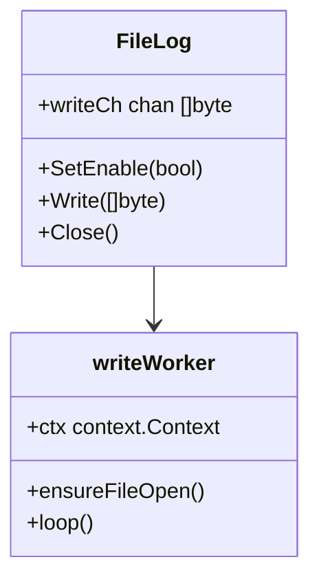
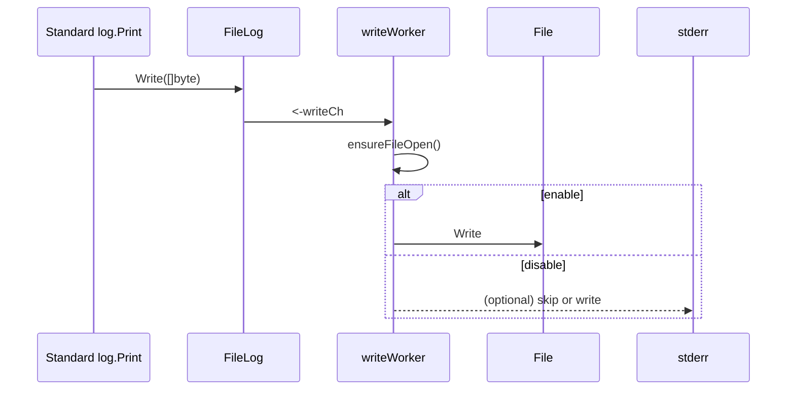

# FileLog non-blocking write plan

## 1. 概要と目的 Overview and Purpose
- **What**  
  `pkg/filelog.FileLog` の `Write` が `Logger.SetEnable(false)` のときに `os.Stderr.Write` へ同期的に書き込むため、タスクトレイや GUI のメッセージループをブロックしていた現象を解消する。無効モードでも必ず内部チャネルに書き込み、非同期の `writeWorker` で処理する構造へ改善する。
- **Why**  
  `Logger.SetEnable(true)` をハードコードしてログ出力を有効にすると GUI 操作は復活するが、そのままリリースするとユーザーが Debug log を気軽に切り替えられないし、`stderr` 書き込みがブロックして UI が死ぬ根本原因を残す。プロダクトとしてログの無効状態でも UI が反応することが必要。
- **How**  
  `FileLog.Write` で「ログが無効」状態でも `writeCh` に enqueue し、`writeWorker` が there is something to do? ensures to drop or write to `stderr` but still asynchronous. `SetEnable` はファイルへの出力だけを切り替えるフラグとし、`writeWorker` が `fl.GetEnable()` を見てファイル/標準エラーの扱いを決める。また `writeWorker` 側には `select` で `ctx.Done()` と channel 両方を待ち、`Logger.SetEnable(false)` でも deadlock しないよう早期 return する。

## 2. 仕様と受け入れ条件 Specification and Acceptance Criteria

### 2.1 スコープ Scope
- `FileLog.Write` の枝分岐を見直し、`enable` フラグにかかわらず `writeCh` に値を送る。
- `writeWorker` では `fl.GetEnable()` に応じてファイル出力の有無を決める。
- UI（タスクトレイ）が非アクティブでも `log.Print` 系がブロックしない設計とし、`Logger.SetEnable(true)` を埋め込まなくてもタスクトレイのクリックが反応する。

### 2.2 非スコープ Non Scope
- `FileLog` の出力フォーマットや保存先の変更。
- 既存のログディレクトリ構造や `Logger` 以外のロガーへの波及。

### 2.3 ユースケース Use Cases
1. デフォルト（`SetEnable(false)`）でもアプリ起動直後にトレイ操作が可能で、`Logger` は内部バッファに書き込むため UI が止まらない。
2. `SetEnable(true)` を UI から切り替えるとファイルが生成され、`writeWorker` がファイル出力と合わせて `stderr` 出力を続ける。
3. タスクトレイのクリック後に `log.Print` が走っても `writeCh` が即座に受け取るので goroutine が詰まらず、`Logger.Close()` まで安全に処理される。

### 2.4 受け入れ条件 Acceptance Criteria
1. Given `Logger.SetEnable(false)` When タスクトレイを右クリック/左クリックしても Then タスクトレイが即座に反応し、`log.Print` が UI をブロックしない。
2. Given `Logger.SetEnable(false)` When `log.Print` を大量に呼んでも Then `writeCh` に流れ `worker` がファイル/`stderr` 出力を非同期で実行し、これらの呼び出しはすぐに戻る。
3. Given `Logger.SetEnable(true)` When `writeWorker` がファイルへ書き込みするとき Then `FilePath` に `/OmniSSHAgent/YYYY/MM-DD.log` が作られ、ログが追える。
4. Given `Logger.SetEnable(false)` When `writeWorker` がファイルを開くとき Then `writeCh` を Drain して `Close` するときにも panic や deadlock が発生しない。

### 2.5 既知の制約 Known Limitations
- `writeCh` のバッファサイズは 1 なので超過した場合には書き込みがブロックする可能性が残る → 今回は logger がほとんどブロックしないように `writeCh` の容量と `writeWorker` の優先度を確保する。
- ジョブが大量ログを吐く状況では file I/O が追いつかず channel の backpressure で若干遅延するが、UI 反応は保たれる。

## 3. 前提技術スタック Context and Tech Stack
- Language Framework: Go 1.22。
- Libraries: 標準 `log`, `os`, `sync`, `context`。
- Style Guide: 既存 `gofmt`/`go fmt`、タブインデント。
- Runtime Deployment: Windows GUI アプリ（Wails）、`Logger` が `os.UserConfigDir` に書き込む。
- Testing: `go test ./...`、`pkg/filelog` に対するユニットテストで `writeWorker` の非同期挙動を検証。

## 4. インターフェース契約 Interface Contracts

### 4.1 公開APIまたは外部I O一覧
- CLI なし（Wails UI 経由）。
- ロギング先 変更：`os.UserConfigDir` + `log.SetOutput` が `filelog.Logger`。
- 永続化：ログファイル構造を JSON などではなく単純なテキスト。

### 4.2 データモデルとスキーマ
- `filelog.FileLog` は `writeCh chan []byte` を持ち、`Write(p []byte)` で `p` をそのまま enqueue。
- `writeWorker` はチャネルから `[]byte` を取り出し、`log.SetOutput` で行われる `log.Print` からの `[]byte` を単純にファイル/`stderr` に転送する。

### 4.3 エラーと例外 Error Handling
- `writeWorker` が `fl.ensureFileOpen` で error になっても `writeCh` を drain して `log.Printf` でエラーを書き全部 `stderr` 出力。
- `Write` 中に `writeCh` が full になった場合は `Logger` が `ctx.Done()` を参照して `context` cancellation でリトライしない。
- `SetEnable(false)` 時は `writeWorker` が `os.Stderr` 出力を行わず、`Write` は内部チャネルにのみ enqueue してすぐ return。

### 4.4 代表的な例 Examples
1. `log.Print("Quit was clicked");` が呼ばれると `writeCh` に `[]byte` が入り `writeWorker` が即座に `file` に flush。
2. `Logger.SetEnable(false)` でタスクトレイをクリックしたとき、`writeWorker` が `fl.GetEnable()` で false を検知し `stderr` への出力（`os.Stderr.Write`）をスキップ。
3. アプリ終了時 `Logger.Close()` を呼ぶと `writeWorker` が `ctx.Done` を検出して `writeCh` を drain して `f.Close()` してリソース解放。

## 5. アーキテクチャと設計図 Architecture and Diagrams

### 5.1 図の選択方針
- `FileLog` と `writeWorker` の責務分離が大事なので、クラス図とシーケンス図を追加する。

### 5.2 クラス図 Class Diagram

### 5.3 その他の図 Optional

## 6. テスト戦略 Test Strategy

### 6.1 テストの種類
- Unit: `FileLog.Write` が enable/disable 両モードですぐ return することを確認する。
- Integration: ダミー `log.Print` を連打し、`writeWorker` が goroutine leak せず `writeCh` を処理することを `go test` で堅牢化。
- Contract: `writeWorker` が `ctx.Done()` で終了するよう `FileLog.Close()` で `wg` を待機するテストを追加。

### 6.2 カバレッジ対象
- `Write` の enable/disable 分岐。
- `writeWorker` のファイルオープン失敗時処理。
- `Close` 時の `writeCh` `drain`。

## 7. 実装タスクリスト Implementation Plan

### Phase 1 設計と準備
- [x] 要件と仕様の確定（この計画書）
- [x] インターフェース契約の確定（Write/Close の契約と `SetEnable` の意味）
- [x] Mermaid 図の作成（上記クラス・シーケンス図の練り込み）
- [x] インターフェース 型定義の作成（`writeCh` の使い方など明文化）
- [x] テスト基盤の確認（`pkg/filelog` 用の go test skeleton）

### Phase 2 Enable=false での非同期化
- [x] Test: `Write` が `SetEnable(false)` 時でも return し、`writeCh` への enqueue を確認するユニット。
- [x] Impl: `Write` が `fl.GetEnable()` に依存せず channel へ書き込み、`writeWorker` で `fl.GetEnable()` を見て出力先を切り替える。
- [x] Refactor: `writeWorker` 内の `select` を整理し `ctx.Done()` での drain ロジックを整える。
- [ ] Integration: `log.Print` 連打で `writeWorker` が goroutine leak せず、UI が止まらないことを手動確認。
- [ ] Docs: 設定ファイルや AGENTS に「Logger は非同期で stdout へ書く」と明記。

### Phase 3 Enable=true ファイル出力拡充
- [x] Test: `writeWorker` が enable true のときに `ensureFileOpen` を呼び出すテスト。
- [x] Impl: `ensureFileOpen` の error を `log.Printf` して `writeCh`を drain。
- [ ] Refactor: `Logger.SetEnable(true)` の呼び出しを UI から e.g. `mLogCheckBox` で制御できるように調整。
- [ ] Integration: ログ設定画面で toggle して `Settings` に反映されることを確認。
- [ ] Docs: ログファイルのパスとヒントを README に追記。

### Phase 4 統合と検証
- [x] 全体テスト: `go test ./...`（`pkg/filelog` 追加テストを含む）。
- [ ] エッジケース: `ctx` cancel 後の `writeCh` `drain` を確認。
- [ ] ログと例外: `log.Print` (UI)→`stderr` への fallback が一貫していることを確認。
- [ ] ドキュメント更新: `doc/dev/check-fix.md` などに修正内容を記載。

## 8. 完了の定義 Definition of Done
### 8.1 機能DoD Functional DoD
- [ ] `Logger.SetEnable(false)` でも GUI がブロックしないこと。
- [ ] `writeWorker` が `ctx.Done()` で終了するコンストラクトを保持していること。
- [ ] UI から `Debug log` をトグルできること。

### 8.2 品質DoD Quality DoD
- [ ] `go test ./...` が通過。
- [ ] `Logger` のロジックに panic などがなくなる。
- [ ] ドキュメント、`doc/dev` などに説明。

## 9. 懸念事項と未確定事項 Concerns and Questions
- `writeCh` のバッファサイズ 1 のままだと bursts で backpressure になるが、UI がブロックしない限り許容。
- `log.Print` の大量出力を捌ける worker goroutine の throughput はオプションで monitor するべきか。
