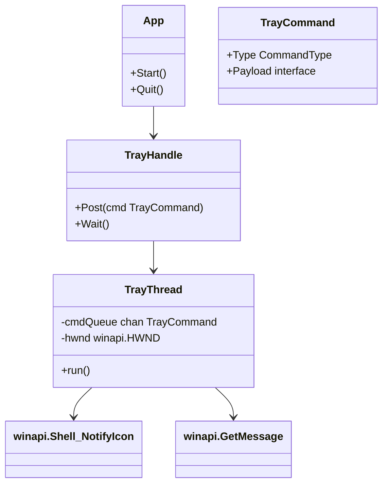
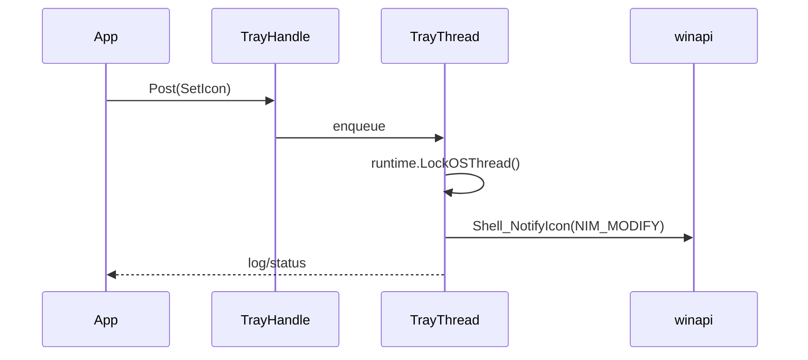

## 1. 概要と目的 Overview and Purpose
- What  Win32 通知領域アイコン処理を専用スレッド (TrayThread) にまとめ、OS スレッド固定、Win32 API 呼び出しをそこに集約して goroutine のスレッドアフィニティ問題を解消する。
- Why  トレイアイコンの表示・イベント受信・終了処理が goroutine により異なる OS スレッドで走ることで不安定となる問題を根本解決し、安定した UI 体験とリソースリーク防止を実現する。
- How  既存 `wintray.TrayIcon` を TrayThread でラップし、`runtime.LockOSThread()` した goroutine 上でメッセージループを維持しながら、チャネルを介したコマンドで他 goroutine の要求を逐次処理する。

## 2. 仕様と受け入れ条件 Specification and Acceptance Criteria
### 2.1 スコープ Scope
- Win32 トレイ UI に関する Win32 API 呼び出し (ウィンドウ作成、Shell_NotifyIcon、メニュー操作) を TrayThread に限定する。ニューコンポーネントの起動・終了、コマンドキュー、エラーハンドリングを含む。
- App 側からは `StartTrayThread`, `StopTrayThread`, `PostTrayCommand` などの最小 API を提供し、本体 goroutine は Win32 API を直接触らないように保証する。
- 必要な設定 (トレイアイコン再登録、メニュー操作、バルーン通知) を新設したコマンドセットに移行する。
- 制約として、TrayThread は重い処理を含まず、同期/待機は `sync.WaitGroup` やチャネルで調整する。

### 2.2 非スコープ Non Scope
- Win32 以外のエージェント機能 (NamedPipe/Unix/cygwin) やフロントエンド UI 変更は含まない。
- トレイ UI の完全リファクタリング (メニュー構成の再設計など) は別ストーリー。

### 2.3 ユースケース Use Cases
1. 正常系: App 起動時、TrayThread が起動し `runtime.LockOSThread()` された専用 OS スレッドでウィンドウ作成、`Shell_NotifyIcon(NIM_ADD)`、GetMessage ループを開始。App は `PostTrayCommand` でメニュー生成やアイコン変更を依頼できる。
2. 異常系: Win32 呼び出しで `Shell_NotifyIcon` が失敗した場合、TrayThread がログ出力し再試行コマンドをキューに登録、App はトレイ表示失敗を検知してユーザーへ通知。
3. シャットダウン: App が `StopTrayThread` で `PostQuitMessage` を送信し、TrayThread は `Shell_NotifyIcon(NIM_DELETE)` を実行後、`runtime.UnlockOSThread()` して終了。終了後に `sync.WaitGroup` で完遂を待つ。
4. メニュー選択: OS が `WM_COMMAND` を送信すると TrayThread が対応する MenuItem へ `ClickedCh` を送信し、App は goroutine で `select` して処理する。

### 2.4 受け入れ条件 Acceptance Criteria
1. Given TrayThread 起動時 When `StartTrayThread` が `runtime.LockOSThread()` した goroutine で Win32 初期化を行い Then `Shell_NotifyIcon(NIM_ADD)` と `GetMessage` ループが同一 OS スレッドで生存している。
2. Given 本体 goroutine When `PostTrayCommand` で Icon/Tooltip/ShowBalloon 等を要求 Then すべて TrayThread 上で `Shell_NotifyIcon` への変更が行われ、Win32 API 呼び出しが他スレッドに分散しない。
3. Given TrayThread 中 `CreateWindowEx` または `Shell_NotifyIcon(NIM_ADD)` が失敗 When Win32 がエラーを返した場合 Then Windows メッセージボックスで「トレイ登録に失敗した」旨を表示して `os.Exit(1)` し、プログラム起動中にトレイがない状態で放置しない。
4. Given App 終了 When `StopTrayThread` で quit コマンドを送信 Then TrayThread は `PostQuitMessage` を投げてループを抜け `Shell_NotifyIcon(NIM_DELETE)` を実行し、`WaitGroup` 経由で終了を待つ。
5. Given `mQuit.ClickedCh` などでメニューイベントが走る When Win32 から `WM_COMMAND` が来た Then TrayThread は `MenuItem.ClickedCh` を適切に通知する。

### 2.5 既知の制約 Known Limitations
- TrayThread は OS スレッドを専有するため、UI 以外の業務ロジックを投入しないことが前提。動作中の重い同期処理はチャネルで分離。
- `runtime.LockOSThread()` はアプリケーション起動中ずっと保持されるため、メッセージループ中のゴルーチンは OS スレッド上でしか動かず、CPU 負荷に注意 (ただしトレイ用途なので許容範囲とする)。

## 3. 前提技術スタック Context and Tech Stack
- Language Framework: Go 1.26, Wails バックエンド。WSL からは `go.exe` ツールを使う。
- Libraries: `github.com/cwchiu/go-winapi` による Win32 API 呼び出し、`golang.org/x/sys/windows` で `LockOSThread` の管理。
- Style Guide: gofmt、タブインデント、既存パッケージ構造 (pkg/wintray) に合わせる。
- Runtime Deployment: Windows 用 Wails アプリ、Win32 API 呼び出しは 64-bit Windows 環境を前提。
- Testing: `go test ./...` または WSL 時は `go.exe test ./...` でユニットを走らせ、Win32 API は疎通テストでローカルレビュー。

## 4. インターフェース契約 Interface Contracts
### 4.1 公開 API または外部 I/O 一覧
- CLI/HTTP: なし（WinTray UI 内部）。
- 設定ファイル: 変更なし。
- 永続化: なし。
- 外部サービス連携: Win32 Shell via `Shell_NotifyIcon`, `CreateWindowEx`, `GetMessage`。
- App との境界: `func StartTrayThread(opts TrayOptions) (*TrayHandle, error)`、`func (h *TrayHandle) Post(cmd TrayCommand)` など。

### 4.2 データモデルとスキーマ
- TrayCommand: `enum { SetIcon, SetTooltip, ShowBalloon, UpdateMenu, Quit }` + ながらオプション (文字列, icon handle, callback)。
- MenuItem: `ClickedCh chan struct{}` は従来通り。TrayThread は `map[uint32]*wintray.MenuItem` を保持。
- Validation: 各コマンドは nil チェック・アイコン/テキストの長さ制限 (TIP 128文字) を行う。

### 4.3 エラーと例外 Error Handling
- 重大エラー: `CreateWindowEx` または `Shell_NotifyIcon(NIM_ADD)` が失敗したら Windows のメッセージボックスでエラーダイアログを表示し、`os.Exit(1)` で即時終了して再登録を行わない。`TrayThread.Post` は非同期で `error` を返さないため、重大な失敗はトレイスレッド内で検出しダイアログを出す。
- リトライ方針: 再登録/リトライは行わず、失敗は即時ポップアップ → 終了、という動作を契約とする。
- タイムアウト: トレイ用 goroutine は通常の Win32 メッセージループに任せ、独自のタイムアウトは実装しない。エラーは `log.Printf` で残す。
- ログ: Win32 API に関連するエラーのみログに出力し、個人情報を含まない。

### 4.4 代表的な例 Examples
1. 起動 API:
```
handle, err := wintray.StartTrayThread(wintray.TrayOptions{Title: "OmniSSHAgent"})
if err != nil { log.Fatal(err) }
``` 
2. メニュー付き通知:
```
handle.Post(wintray.TrayCommand{Type: wintray.CommandShowBalloon, Title: "鍵を使用"})
``` 
3. 終了:
```
handle.Post(wintray.TrayCommand{Type: wintray.CommandQuit})
handle.Wait()
```

## 5. アーキテクチャと設計図 Architecture and Diagrams
### 5.1 図の選択方針
Win32 API、App、TrayThread の間で責務とデータフローが分かれるため、クラスタイプのクラス図を必須とし、メッセージループ対チャネルという非同期の振る舞いを簡単なシーケンスで補足する。

### 5.2 クラス図 Class Diagram


### 5.3 その他の図 Optional


## 6. テスト戦略 Test Strategy
### 6.1 テストの種類
- Unit: `wintray/traythread_test.go` で `TrayCommand` のキュー処理と `commandExecutor` ロジックをテスト。`testing.T` で `runtime.LockOSThread()` を呼ぶラッパー関数を使い、本体ロジックを関数単位で検証。
- Integration: `app_test.go` で `StartTrayThread` を起動し、ゴルーチン間のコマンドフロー (SetIcon, ShowBalloon, Quit) を `sync.WaitGroup` で追跡し、実際の Win32 呼び出しを `winapi` のテストダブルでモック。
- Contract: App 側が直接 `Shell_NotifyIcon` を呼べなくなるよう `TrayHandle` を介在させ、古い API を隠蔽した上で `cmd/agent-bench` の `WinTray` サブコマンドで同様のフローを走らせて保証。

### 6.2 カバレッジ対象
- `TrayCommand` の各種類 (SetIcon, SetTooltip, ShowBalloon, Quit)。
- `TrayThread` が `runtime.LockOSThread()` を呼んで以降、`GetMessage` ループを保持し続けるか。
- `CreateWindowEx` / `Shell_NotifyIcon(NIM_ADD)` 失敗時に `reportTrayFatalError` が呼ばれてダイアログ表示と `os.Exit` をトリガーすること。

## 7. 実装タスクリスト Implementation Plan
### Phase 1 設計と準備
- [x] 要件と仕様の確定 受け入れ条件をこのドキュメントに定義
- [x] インターフェース契約の確定 既存の `wintray.TrayIcon` API から移行するコマンドのリスト作成
- [x] Mermaid 図の作成 クラス図・シーケンス図
- [x] インターフェース型定義の作成 `TrayCommand`, `TrayHandle`, `TrayOptions`
- [x] テスト基盤の確認 `go test` を `go.exe test` で Windows DLL との互換性を確認

### Phase 2 TrayThread の実装
- [x] Test TrayThread command queue の失敗するテストケースを追加 (Red)
- [x] Impl コマンド実行と `runtime.LockOSThread()` を含む最小実装 (Green)
- [x] Refactor `wintray.TrayIcon` のコマンドベース実装へリファクタリング
- [x] Integration TrayThread を App 起動パスへ統合し、Win32 API 呼び出しを一元化
- [x] Docs Docstrings および `doc/plan/` 記録を更新

### Phase 3 アプリケーション連携と安定化
- [x] Test メニュー/バルーン関連のコマンドテストを追加
- [x] Impl App 側の `systrayOnReady` から TrayHandle へ指示する実装（既存の `MenuItem` 連携）
- [x] Refactor WinTray 終了フローの `Quit` 処理を TrayThread 経由に変更
- [x] Integration `a.Quit` 時に TrayThread を `StopTrayThread` して `sync.WaitGroup` で完了待ち
- [x] Docs `doc/dev/issue-tasktry.md` 参照を含むコメントを追加

### Phase 4 まとめと検証
- [x] 全体テストの実行 `go.exe test ./...`（WSL 環境あり）
- [x] エッジケースの動作確認 MenuItem Click 前後のロック状態など
- [x] ログと例外の確認: `CreateWindowEx` や `Shell_NotifyIcon(NIM_ADD)` 失敗時に `reportTrayFatalError` が呼ばれ、ダイアログ表示→終了となることを検証
- [x] ドキュメント更新 仕様、契約、図表の最終版への反映

## 8. 完了の定義 Definition of Done
### 8.1 機能 DoD
- [ ] 受け入れ条件の全項目が `doc/plan/` に示した通り確認済み
- [ ] 既知の制約がドキュメントで明示されている
- [ ] 代表例 (UI 設定→ShowBalloon→Quit) で期待結果が得られる

### 8.2 品質 DoD
- [ ] `go.exe test ./...` が WSL または Windows パラメータで通過
- [ ] `gofmt` 適用済み
- [ ] 不要なデバッグコード/`log.Print` は整理
- [ ] `doc/dev/issue-tasktry.md`, `doc/plan/` に変更を反映

## 9. 懸念事項と未確定事項 Concerns and Questions
- Win32 API をモックする代替が必要なテストはどこまで許容されるか（CI で実際の Shell_NotifyIcon を呼べないため）。
- `TrayThread` が `runtime.LockOSThread()` を呼んだ後に `winapi.GetMessage` をブロックし続ける間、`Go` ランタイム側でスレッドプールの影響があるか確認が必要な点。
- 最終的に `TrayHandle.Post` がエラーを返さないので、UI スレッドでの `Shell_NotifyIcon` 失敗を上位に伝える手段をどうするか。現在はログ再試行で済ませるが、必要なら `error` チャンネルを追加。
