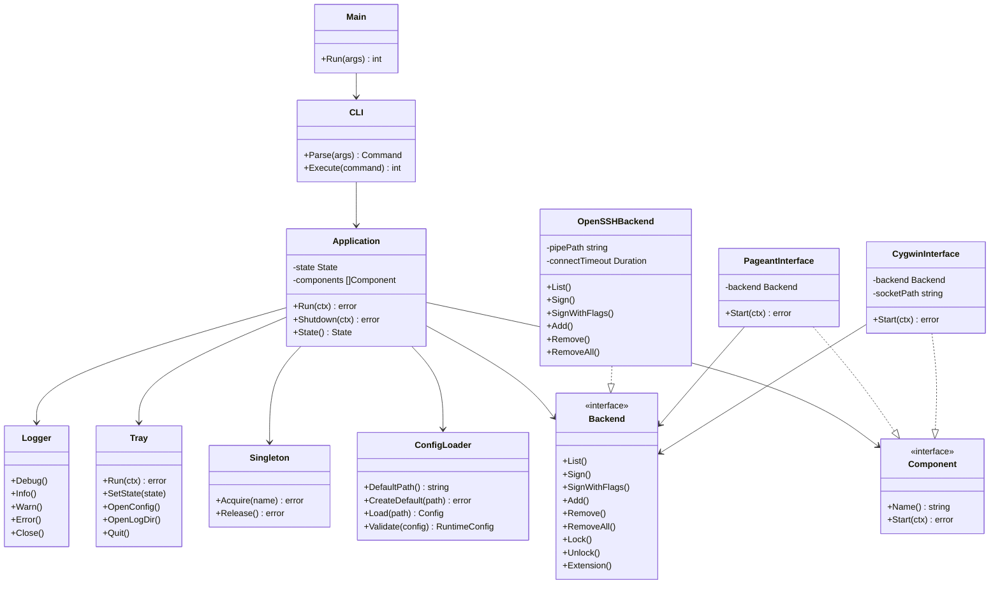
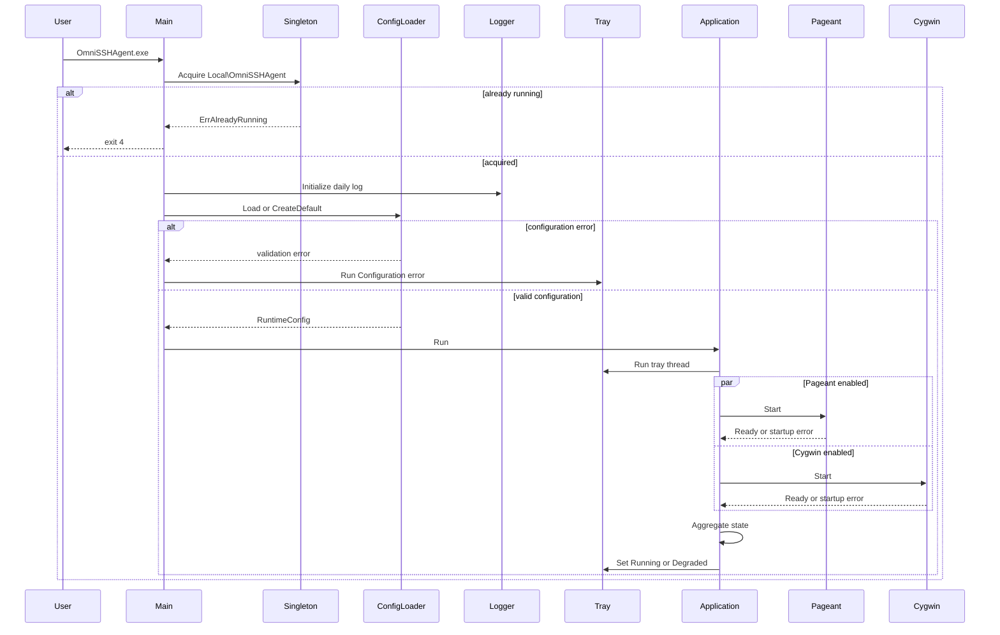
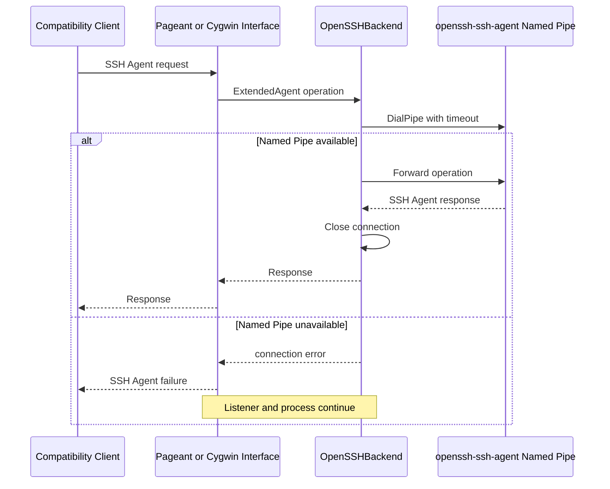
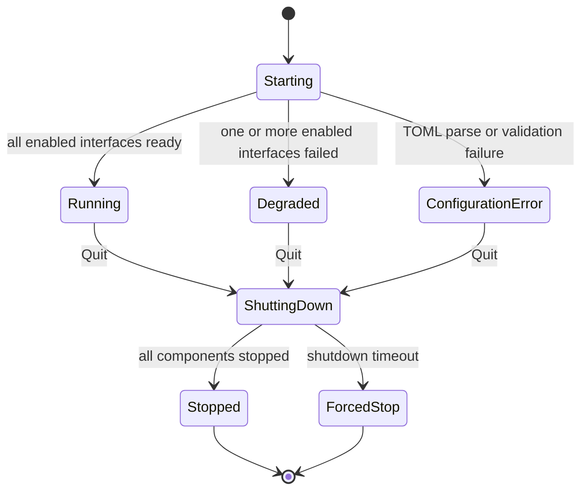

# OmniSSHAgent Windows MVP 実装計画

> 計画ファイル: `doc/plans/260720-s01-omnisshagent-windows-mvp.md`
> 要求仕様: `doc/requirements/260720-omnisshagent-windows-mvp-requirements.md`
> 対象リポジトリ: `masahide/OmniSSHAgent`  
> 対象OS: Windows 11 x86-64  
> 計画日: 2026-07-20 Asia/Tokyo

## 1. 概要と目的 Overview and Purpose

### What

OmniSSHAgentを、Windows OpenSSH AgentをバックエンドとしてPageant互換およびCygwin/MSYS2互換インターフェースを提供する、Windows専用のタスクトレイ常駐アプリケーションへ再構築する。

MVPではGUIとローカル鍵管理を実装せず、次の機能に限定する。

- Windows OpenSSH Agent Named Pipeを利用するバックエンド
- Pageant互換インターフェース
- Cygwin/MSYS2互換インターフェース
- TOML設定ファイル
- タスクトレイ
- 名前付きMutexによる多重起動防止
- 日付単位のファイルログ
- コンポーネント単位の障害分離
- 安全なシャットダウン
- 最小限の診断CLI

### Why

現在の実装では、Wails UI、鍵管理、各SSH Agentインターフェース、設定、トレイ、終了処理が`main.go`と`app.go`へ集中している。また、WSL用プロキシやUnix Domain Socket実装も同一リポジトリに含まれている。

WSL連携はPipeferryへ分離済みであるため、OmniSSHAgentはWindows内の互換インターフェース変換に専念できる。

本再構築によって、次の価値を得る。

- Wails、WebView2、Node.js、Svelteへの実行時およびビルド依存を削除する
- Windows OpenSSH Agentを単一の鍵管理元として利用する
- PageantとCygwin/MSYS2利用アプリケーションをWindows OpenSSH Agentへ接続する
- 各インターフェースの障害をアプリケーション全体から分離する
- GUI実装前に、常駐プロセスとして必要な基盤を確立する
- 後続のWeb UIやローカル鍵バックエンドを追加しやすい責務構造へ整理する

### How

次のアーキテクチャを採用する。

1. `cmd/omnisshagent`をWindows専用エントリーポイントとする
2. `internal/config`でTOML設定を厳密に読み込む
3. `internal/backend/openssh`で要求単位のNamed Pipe接続を提供する
4. PageantとCygwin/MSYS2を共通バックエンドへ接続する互換インターフェースとして実装する
5. `internal/app`でコンポーネントの起動、状態集約、停止を管理する
6. `internal/tray`で状態表示、設定ファイル表示、ログ表示、終了操作を提供する
7. WSL、Wails、ローカル鍵管理に関するコードと依存をMVPのビルド対象から除去する
8. 既存のWindows低レベル実装は、契約テストを追加してから移動または整理して再利用する

### 現行実装からの主な移行点

| 現行対象 | 問題 | MVPでの方針 |
|---|---|---|
| `main.go` | Wails起動、設定、ログ、多重起動判定が集中 | `cmd/omnisshagent/main_windows.go`へ置換 |
| `app.go` | Agent、Wailsイベント、鍵管理、トレイ、終了処理が集中 | `internal/app`、`backend`、`interfaces`、`tray`へ分割 |
| `pkg/namedpipe/client.go` | OpenSSH Agentクライアントとして再利用可能 | `internal/backend/openssh`へ整理 |
| `pkg/pageant` | 低レベル実装は再利用可能だが境界検証と起動結果通知が不足 | 契約テスト後に`internal/interfaces/pageant`へ整理 |
| `pkg/cygwinsocket` | 部分読み込み、既存ファイル削除、安全な所有判定を改善する必要がある | 契約テスト後に`internal/interfaces/cygwin`へ整理 |
| `pkg/wintray` | OSスレッド固定設計は維持する価値がある | Wails依存を外し`internal/tray`へ整理 |
| `pkg/store` | JSONとローカル鍵管理を前提としている | MVPでは廃止しTOML設定へ置換 |
| `frontend`、`wails.json` | MVPでは不要 | 削除 |
| WSL関連コード | Pipeferryと責務重複 | 削除または廃止 |
| `.github/workflows/format.yml` | Node、frontend、hackを前提としている | Go中心のWindows CIへ置換 |

## 2. 仕様と受け入れ条件 Specification and Acceptance Criteria

### 2.1 スコープ Scope

#### 今回やること

- Windows専用の`OmniSSHAgent.exe`を構築する
- 引数なし起動でタスクトレイ常駐モードを開始する
- `%APPDATA%\OmniSSHAgent\config.toml`を読み込む
- 初回起動時にデフォルト設定を生成する
- TOMLの未知フィールドをエラーにする
- Windows OpenSSH Agentを既定バックエンドとする
- `\\.\pipe\openssh-ssh-agent`へ要求単位で接続する
- Pageant互換要求をバックエンドへ転送する
- Cygwin/MSYS2互換要求をバックエンドへ転送する
- PageantとCygwinを個別に有効化または無効化できるようにする
- 一部インターフェース失敗時にDegraded状態で継続する
- 設定エラー時にConfiguration error状態のトレイだけを起動する
- 名前付きMutexで同一ユーザーセッション内の多重起動を防止する
- 日付単位のログファイルへ安全な診断情報を記録する
- タスクトレイから設定ファイル、設定ディレクトリ、ログディレクトリを開く
- タスクトレイから正常終了する
- `version`、`check-config`、`config-path`コマンドを提供する
- Wails、WebView2、Node.js、Svelte、WSL関連実装をMVPから削除する
- Windows向けテスト、ビルド、静的検査をCIへ追加する

#### 成果物

- `OmniSSHAgent.exe`
- `config.toml`のデフォルト生成機能
- TOML設定リファレンス
- Windows OpenSSH Agentバックエンド
- Pageant互換インターフェース
- Cygwin/MSYS2互換インターフェース
- タスクトレイ
- 日付単位ログ
- Windows向けCI
- 更新されたREADME
- PipeferryのWSL連携ドキュメントへの案内

#### 制約

- Windows 11 x86-64のみを正式対象とする
- Go 1.25.6を使用する
- バックエンドは`windows-openssh`のみとする
- OpenSSH Agent Named PipeをOmniSSHAgent自身が再公開してはならない
- 設定変更のホットリロードは行わない
- Windowsログオン時の自動起動登録は行わない
- 秘密鍵とパスフレーズをOmniSSHAgentが保持しない
- PageantとタスクトレイのWin32メッセージループは専用OSスレッドで実行する
- SSH Agentペイロードをログへ出力しない

### 2.2 非スコープ Non Scope

- Wails、WebView2、Web UI
- ローカルHTTPサーバー
- GUIによる設定編集
- GUIによる鍵一覧、鍵追加、鍵削除
- ローカル秘密鍵バックエンド
- インメモリSSH Agent
- Windows Credential Managerによるパスフレーズ管理
- WSL1 Unix Domain Socket
- WSL2プロキシ
- Pipeferryのインストール、起動、設定
- PowerShellによるNamed Pipeプロキシ
- Windows OpenSSH Agentと同名のNamed Pipeサーバー
- 任意のNamed Pipeサーバー
- 設定ホットリロード
- Windowsログオン時の自動起動登録
- MSIまたはMSIX形式のインストーラー
- Authenticode署名
- 自動アップデート
- Windows 10、Windows ARM64、macOS、Linuxの正式対応
- 複数バックエンドの統合
- systemd、WSL、Cygwinプロセス自体の管理

### 2.3 ユースケース Use Cases

#### UC-01 初回起動

1. ユーザーが`OmniSSHAgent.exe`を起動する
2. 設定ファイルが存在しない
3. デフォルト`config.toml`が生成される
4. PageantとCygwinインターフェースが起動する
5. タスクトレイにRunning状態が表示される

#### UC-02 Pageantクライアントから利用

1. Windows OpenSSH Agentに鍵が登録されている
2. PuTTY、WinSCP、TortoiseGitなどがPageant要求を送る
3. OmniSSHAgentが共有メモリから要求を読み取る
4. Windows OpenSSH Agentへ要求単位で接続して転送する
5. 応答をPageant共有メモリへ返す

#### UC-03 Git for WindowsまたはMSYS2から利用

1. OmniSSHAgentがCygwin互換ソケットファイルを生成する
2. クライアントがソケットファイルを参照して接続する
3. nonceハンドシェイクを完了する
4. SSH Agent要求をWindows OpenSSH Agentへ転送する
5. 鍵一覧取得または署名が成功する

#### UC-04 バックエンド停止と回復

1. Windows OpenSSH Agentが停止している
2. クライアント要求がバックエンド接続エラーになる
3. OmniSSHAgent本体と各リスナーは継続する
4. Windows OpenSSH Agentを起動する
5. 次の要求がOmniSSHAgent再起動なしで成功する

#### UC-05 一部インターフェースの競合

1. 別のPageant互換アプリケーションがPageant Window Classを使用している
2. OmniSSHAgentのPageant起動が失敗する
3. Cygwin互換インターフェースは継続する
4. タスクトレイはDegraded状態を表示する
5. 競合理由がログへ記録される

#### UC-06 設定ファイルの修復

1. `config.toml`に構文エラーまたは未知フィールドがある
2. OmniSSHAgentは互換インターフェースを起動しない
3. タスクトレイはConfiguration error状態で起動する
4. ユーザーがOpen configurationで設定ファイルを修正する
5. OmniSSHAgentを終了して再起動すると設定が反映される

#### UC-07 正常終了

1. PageantとCygwinインターフェースが動作している
2. ユーザーがタスクトレイのQuitを選ぶ
3. 新規受付を停止する
4. 各メッセージループとリスナーを停止する
5. Cygwinソケットと所有マーカーを削除する
6. Mutexとログを解放して終了する

### 2.4 受け入れ条件 Acceptance Criteria

#### AC-01 初回起動と設定

Given `config.toml`が存在しないWindows 11環境  
When `OmniSSHAgent.exe`を引数なしで起動する  
Then デフォルト設定が生成され、タスクトレイへ常駐し、設定が正常ならRunning状態になる。

#### AC-02 Pageant互換

Given Windows OpenSSH Agentに利用可能な鍵がある  
When Pageant互換クライアントが鍵一覧取得または署名を要求する  
Then OmniSSHAgentは要求を`\\.\pipe\openssh-ssh-agent`へ転送し、クライアントへ有効な応答を返す。

#### AC-03 Cygwin/MSYS2互換

Given Cygwin互換インターフェースが有効である  
When Git for WindowsまたはMSYS2のSSHクライアントが生成されたソケットを利用する  
Then nonceハンドシェイク、鍵一覧取得、署名が成功する。

#### AC-04 バックエンド障害と回復

Given Windows OpenSSH Agentが停止している  
When クライアント要求が行われた後にWindows OpenSSH Agentを起動して再要求する  
Then 最初の要求だけが失敗し、OmniSSHAgentを再起動せず次の要求が成功する。

#### AC-05 障害分離と縮退動作

Given Pageant競合、Cygwinソケット競合、または設定エラーがある  
When OmniSSHAgentを起動する  
Then 設定が有効な場合は利用可能なインターフェースを継続してDegradedとなり、設定が無効な場合はトレイだけをConfiguration error状態で起動する。

#### AC-06 多重起動と正常終了

Given OmniSSHAgentがすでに起動している  
When 2つ目を起動する、または既存プロセスでQuitを選択する  
Then 2つ目はリスナーを作成せず終了コード4で終了し、既存プロセスは10秒以内にリソースを解放して終了する。

#### AC-07 Windows専用MVPへの移行

Given MVPブランチをビルドして依存関係と成果物を確認する  
When `go test ./...`、`go vet ./...`、Windowsビルドを実行する  
Then Wails、WebView2、Node.js、Svelte、WSLプロキシ、WSL Unix Socket、PowerShellプロキシがビルドと実行に含まれず、すべての検証が成功する。

### 2.5 既知の制約 Known Limitations

- Windows OpenSSH Agentまたは互換Named Pipeサービスは利用者側で起動する必要がある
- Pageant互換Window Classは同時に複数の実装が所有できない
- 設定変更にはOmniSSHAgentの再起動が必要
- Cygwin互換ソケットファイルの配置先はWindowsファイルシステム上に限定する
- Windowsログオン時の自動起動はMVP外である
- タスクトレイ以外のGUIはない
- バックエンド状態を常時監視せず、要求時の接続結果でのみ障害を検知する
- 日次ログの保持期間や容量制限は実装しない
- Windows 10とARM64はCIおよびE2Eの対象外である

## 3. 前提技術スタック Context and Tech Stack

### Language and Runtime

- Go 1.25.6
- Windows 11 x86-64
- Windows GUIサブシステム向けビルドを最終成果物とする
- 開発中はコンソール付きビルドも生成できる構成を許可する

### Libraries

- `github.com/Microsoft/go-winio`
  - Windows Named Pipeクライアント
- `golang.org/x/crypto/ssh/agent`
  - SSH Agentプロトコルと`agent.ExtendedAgent`
- `golang.org/x/sys/windows`
  - 名前付きMutex、Win32 API補助
- 既存の`github.com/cwchiu/go-winapi`
  - 初期MVPではPageantとトレイの既存実装を維持するため利用
  - 後続で`x/sys/windows`へ統一するかは別計画とする
- `github.com/pelletier/go-toml/v2`
  - TOMLの読み書き
  - `DisallowUnknownFields`を使った厳密な設定検証
- 標準ライブラリ`log/slog`
  - 構造化されたレベル付きログ
- 標準ライブラリ`flag`
  - 小規模なサブコマンドCLI

### Style Guide

- `gofmt`
- `goimports`
- `go vet`
- 既存のテーブル駆動テスト方針を継続する
- Windows固有ファイルには`//go:build windows`を付与する
- パッケージ名は短い小文字とする
- エラーは小文字で開始し、`fmt.Errorf`と`%w`で原因を保持する
- ペイロード、秘密鍵、パスフレーズをログへ渡さない

### Runtime and Deployment

- 単一の`OmniSSHAgent.exe`
- 既定設定
  - `%APPDATA%\OmniSSHAgent\config.toml`
- 既定ログ
  - `%LOCALAPPDATA%\OmniSSHAgent\logs\omnisshagent-YYYYMMDD.log`
- Cygwin互換ソケット
  - `%USERPROFILE%\.ssh\omnisshagent-cygwin.sock`
- 名前付きMutex
  - `Local\OmniSSHAgent`

### Testing

- `go test ./...`
- `go test -race`はWindows固有Win32メッセージループを除く純粋Goパッケージで実行する
- `go vet ./...`
- Windows Named Pipe統合テスト
- Pageant互換統合テスト
- Cygwin/MSYS2互換統合テスト
- Windows実機E2E
- GitHub Actionsの`windows-latest`

## 4. インターフェース契約 Interface Contracts

### 4.1 公開APIまたは外部I O一覧

#### CLI

```text
OmniSSHAgent.exe
OmniSSHAgent.exe version
OmniSSHAgent.exe --version
OmniSSHAgent.exe check-config
OmniSSHAgent.exe check-config --config C:\path\to\config.toml
OmniSSHAgent.exe config-path
```

#### 設定ファイル

```text
%APPDATA%\OmniSSHAgent\config.toml
```

#### ログファイル

```text
%LOCALAPPDATA%\OmniSSHAgent\logs\omnisshagent-YYYYMMDD.log
```

#### 外部Named Pipe

```text
\\.\pipe\openssh-ssh-agent
```

#### Pageant互換I O

- Window Class
  - `Pageant`
- メッセージ
  - `WM_COPYDATA`
- 共有メモリ
  - SSH Agentプロトコルの長さ付きバイナリメッセージ

#### Cygwin/MSYS2互換I O

- Windows側
  - `127.0.0.1`のランダムTCPポート
- ソケット記述ファイル
  - `!<socket >PORT s NONCE`
- ハンドシェイク
  - 16バイトnonce
  - PID情報
  - SSH Agentストリーム

#### タスクトレイ操作

```text
Status: Running
Open configuration
Open configuration directory
Open log directory
Quit
```

### 4.2 データモデルとスキーマ

#### TOMLモデル

```go
type Config struct {
    Version    int             `toml:"version"`
    Backend    BackendConfig   `toml:"backend"`
    Interfaces InterfaceConfig `toml:"interfaces"`
    Tray       TrayConfig      `toml:"tray"`
    Logging    LoggingConfig   `toml:"logging"`
}

type BackendConfig struct {
    Type           string `toml:"type"`
    Pipe           string `toml:"pipe"`
    ConnectTimeout string `toml:"connect_timeout"`
}

type InterfaceConfig struct {
    Pageant PageantConfig `toml:"pageant"`
    Cygwin  CygwinConfig  `toml:"cygwin"`
}

type PageantConfig struct {
    Enabled bool `toml:"enabled"`
}

type CygwinConfig struct {
    Enabled    bool   `toml:"enabled"`
    SocketPath string `toml:"socket_path"`
}

type TrayConfig struct {
    ShowSignNotifications bool `toml:"show_sign_notifications"`
}

type LoggingConfig struct {
    Level string `toml:"level"`
}
```

読み込み後に、実行用の解決済み設定へ変換する。

```go
type RuntimeConfig struct {
    ConfigPath      string
    BackendPipePath string
    ConnectTimeout  time.Duration
    CygwinPath      string
    PageantEnabled  bool
    CygwinEnabled   bool
    LogLevel        slog.Level
}
```

#### アプリケーション状態

```go
type State string

const (
    StateRunning            State = "running"
    StateDegraded           State = "degraded"
    StateConfigurationError State = "configuration_error"
)
```

コンポーネントごとの起動結果を保持する。

```go
type ComponentStatus struct {
    Name    string
    Enabled bool
    Running bool
    Error   error
}
```

状態集約規則は次とする。

```text
設定エラー
    -> Configuration error

設定正常かつ有効コンポーネントがすべて起動
    -> Running

設定正常かつ一部コンポーネントだけ起動失敗
    -> Degraded

設定正常かつ有効コンポーネントがすべて起動失敗
    -> Degradedでトレイ継続
```

#### Backend契約

```go
type Backend interface {
    agent.ExtendedAgent
}
```

OpenSSHバックエンドは各メソッド呼び出しごとに次を行う。

1. Pipeへ接続
2. `agent.NewClient`を生成
3. 操作を実行
4. 接続を閉じる

共有接続を長期間保持しない。

#### Component契約

```go
type Component interface {
    Name() string
    Start(ctx context.Context) error
}
```

`Start`は起動完了または起動失敗を呼び出し側へ通知できること。メッセージループを開始しただけで成功扱いにせず、Window Class、TCP listener、ソケットファイルなどの必要資源が準備できた後にReadyを通知する。

#### Cygwinソケット所有マーカー

既存ファイルを安全に扱うため、次のサイドカーファイルを使用する。

```text
%USERPROFILE%\.ssh\omnisshagent-cygwin.sock.owner
```

最小内容:

```json
{
  "version": 1,
  "application": "OmniSSHAgent",
  "pid": 1234,
  "nonce": "hexadecimal nonce"
}
```

起動時は次の条件をすべて満たす場合だけ、古いソケットとマーカーを削除する。

- ソケット記述ファイルが期待するCygwin形式である
- 所有マーカーのapplicationが`OmniSSHAgent`である
- nonceがソケット記述ファイルと一致する
- PIDのプロセスが存在しない、または同一プロセスではないと確認できる

条件を満たさない既存ファイルは削除せず、Cygwinコンポーネントを起動失敗にする。

#### デフォルトTOML

```toml
version = 1

[backend]
type = "windows-openssh"
pipe = "openssh-ssh-agent"
connect_timeout = "5s"

[interfaces.pageant]
enabled = true

[interfaces.cygwin]
enabled = true
socket_path = ""

[tray]
show_sign_notifications = false

[logging]
level = "info"
```

### 4.3 エラーと例外 Error Handling

#### エラー分類

| 分類 | 例 | 動作 |
|---|---|---|
| CLI Usage | 不正サブコマンド、不正オプション | 標準エラーへ表示して終了コード2 |
| Configuration | TOML構文、未知フィールド、値検証 | 通常起動ではConfiguration errorトレイ、`check-config`では終了コード3 |
| Singleton | 同一セッションですでに起動中 | 2つ目を終了コード4で終了 |
| Backend Configuration | Pipe名が空、timeout不正 | Configuration errorとして扱う |
| Backend Runtime | Pipe停止、接続timeout、broken pipe | 要求だけ失敗し、次回要求で再試行 |
| Component Startup | Pageant競合、Cygwinファイル競合 | 対象コンポーネントだけ停止しDegraded |
| Tray Startup | Win32 WindowやNotifyIcon生成失敗 | エラーダイアログとログの後、終了コード7 |
| Shutdown Timeout | 10秒以内に停止しない | 残存コンポーネントをログに記録して終了 |
| Internal | panic、想定外状態 | コンポーネント境界でrecoverし、全体停止が必要か判定 |

#### リトライ方針

- OpenSSHバックエンド
  - 自動ループリトライはしない
  - 次のクライアント要求時に再接続する
- Pageant起動競合
  - 起動中の自動リトライはしない
  - OmniSSHAgent再起動で再評価する
- Cygwinファイル競合
  - 起動中の自動リトライはしない
  - ファイル修復後のOmniSSHAgent再起動で再評価する
- 設定エラー
  - 自動再読み込みはしない

#### タイムアウト方針

- OpenSSH Named Pipe接続
  - `backend.connect_timeout`
  - 既定5秒
- シャットダウン
  - 固定10秒
- Cygwinクライアントの初期ハンドシェイク
  - 5秒
- アイドルSSH Agent接続
  - 既存の5分を初期値として維持し、将来設定化を検討する

#### ログ方針

ログへ含める:

- バージョン
- 設定ファイルパス
- コンポーネント名
- 状態遷移
- Win32エラーコード
- Named Pipe接続失敗の分類
- 安全に短縮したファイルパスと処理結果

ログへ含めない:

- SSH Agentバイナリペイロード
- 秘密鍵
- パスフレーズ
- 署名対象データ
- 完全な公開鍵
- Credential Managerの内容
- 環境変数一覧

### 4.4 代表的な例 Examples

#### 初回起動

```powershell
.\OmniSSHAgent.exe
```

期待結果:

```text
%APPDATA%\OmniSSHAgent\config.toml が生成される
タスクトレイに OmniSSHAgent - Running が表示される
```

#### 設定検証

```powershell
.\OmniSSHAgent.exe check-config
```

正常時:

```text
configuration is valid: C:\Users\example\AppData\Roaming\OmniSSHAgent\config.toml
```

異常時:

```text
configuration error at backend.connect_timeout: duration must be greater than zero
```

#### Cygwinインターフェース無効化

```toml
[interfaces.cygwin]
enabled = false
socket_path = ""
```

再起動後はPageantだけを起動し、Running状態とする。

## 5. アーキテクチャと設計図 Architecture and Diagrams

### 5.1 図の選択方針

本変更は設定、Named Pipe、Win32メッセージループ、TCP listener、タスクトレイ、複数コンポーネントのライフサイクルを跨ぐため、次を作成する。

- クラス図
- 起動シーケンス図
- SSH Agent要求シーケンス図
- 状態遷移図

### 5.2 クラス図 Class Diagram



### 5.3 起動シーケンス図



### 5.4 SSH Agent要求シーケンス図



### 5.5 状態遷移図



### 5.6 ライフサイクル不変条件

- `Shutdown`は`sync.Once`で一度だけ実行する
- タスクトレイとPageantのWin32操作は、それぞれの専用OSスレッド内で実行する
- コンポーネントはReadyまたはErrorを必ずApplicationへ返す
- PageantまたはCygwinの失敗で他方をキャンセルしない
- アプリケーション全体のcontextキャンセル時は全コンポーネントを停止する
- バックエンド接続はメソッド呼び出しを超えて共有しない
- Cygwinソケットは作成者が確認できる場合だけ削除する
- タスクトレイ起動失敗時は常駐継続せずプロセスを終了する

## 6. テスト戦略 Test Strategy

### 6.1 テストの種類

#### Unit

##### Config

- デフォルト設定生成
- TOML正常読み込み
- 未知フィールド拒否
- 未対応version拒否
- backend.type検証
- Pipe短縮名の完全パス化
- timeoutの正常系、ゼロ、負数、不正形式
- Cygwin既定パス
- 絶対パス検証
- logging.level検証
- 設定ファイル作成の原子的置換

##### State

- 全コンポーネント成功でRunning
- 一部失敗でDegraded
- すべて無効の場合の扱い
- 設定エラーでConfiguration error
- 状態遷移のトレイ通知

##### OpenSSH Backend

- 各操作ごとにDialとCloseが呼ばれる
- List、Sign、SignWithFlagsの転送
- Add、Remove、RemoveAllの転送
- Lock、Unlock、Extensionの転送
- 接続timeout
- broken pipe
- 一度失敗した後の次回要求で再接続
- 同時要求の独立性
- ペイロードがログへ渡されない

##### Singleton

- 初回Acquire成功
- 同名Mutexの2回目Acquire失敗
- Release後の再Acquire成功
- Win32エラーのラップ

##### Pageant

- 正常なWM_COPYDATA要求
- 共有メモリ名の検証
- 長さヘッダーの境界値
- 最大メッセージ長超過
- マッピング領域を超える長さの拒否
- backendエラーをSSH Agent failureへ変換
- Window Class競合
- contextキャンセルによるメッセージループ停止
- panicをプロセス全体へ伝播させない

##### Cygwin

- socket記述ファイル生成
- nonceエンコード
- `io.ReadFull`による部分読み込み対応
- nonce不一致
- ハンドシェイクtimeout
- loopback以外へバインドしない
- 所有マーカー生成
- 有効プロセスの既存ソケットを削除しない
- staleで所有確認可能なソケットだけ削除
- 通常ファイルとディレクトリを削除しない
- contextキャンセルでlistenerを閉じる
- 終了時に自身のファイルだけ削除する

##### Tray

- メニュー構成
- 状態テキスト更新
- Open configurationのパス
- Open directories
- Quitイベント
- Win32コマンドがトレイスレッドへ配送される
- shutdown中のコマンド破棄

##### CLI

- 引数なし起動
- `version`
- `--version`
- `check-config`
- `check-config --config`
- `config-path`
- 不正引数と終了コード

#### Integration

##### Named Pipe

Windows上でテスト用Named Pipe SSH Agentサーバーを起動し、OpenSSHBackendを実物のPipeへ接続する。

確認項目:

- 鍵一覧
- 署名
- サーバー停止時の接続失敗
- サーバー再起動後の回復
- 並列要求

##### Pageant

テスト用Pageantクライアントまたは既存`cmd/pageant-add`を整理して、共有メモリとWM_COPYDATAを実際に使用する。

確認項目:

- 鍵一覧
- 署名
- backendエラー
- Window Class競合
- 終了処理

##### Cygwin/MSYS2

実際のTCP listenerとsocket記述ファイルを使用するクライアントをテスト内に用意する。

確認項目:

- nonceハンドシェイク
- 鍵一覧
- 署名
- 複数同時接続
- staleファイル
- 終了時クリーンアップ

##### Application

Fake Backendと実物に近いComponentを組み合わせて次を確認する。

- Running
- Degraded
- Configuration error
- Quit
- shutdown timeout
- 連続起動と終了

#### Contract

- TOMLスキーマversion 1
- 未知フィールド拒否
- CLI終了コード
- 既定パス
- Pageant Window Class
- Cygwin socket記述形式
- Pipe短縮名の正規化
- ログ禁止情報
- WSLおよびWails依存がgo.modとビルド成果物に存在しないこと

#### E2E

Windows 11実機で次を確認する。

1. Windows OpenSSH Agentにテスト鍵を追加
2. OmniSSHAgentを起動
3. PuTTYまたはWinSCPでPageant互換接続を確認
4. Git for WindowsまたはMSYS2でCygwin互換接続を確認
5. Windows OpenSSH Agent停止中の失敗を確認
6. Windows OpenSSH Agent再起動後の回復を確認
7. Pageant競合時のDegraded状態を確認
8. タスクトレイQuit後にプロセス、listener、socketファイルが残らないことを確認
9. `wsl --shutdown`やPipeferryの有無がOmniSSHAgent動作へ影響しないことを確認

### 6.2 カバレッジ対象

重点対象:

- 設定バリデーションの全分岐
- Named Pipe接続失敗と回復
- Pageant共有メモリの境界検証
- Cygwinの部分読み込みとnonce検証
- staleソケット削除判定
- コンポーネント起動失敗時の状態集約
- 多重起動
- contextキャンセル
- shutdown timeout
- CLI終了コード

Win32 APIの薄い呼び出し自体ではなく、API呼び出し前後の契約、状態、エラー変換をテスト対象とする。

## 7. 実装タスクリスト Implementation Plan

各タスク完了時にチェックボックスを`[x]`へ更新する。コミットメッセージまたはPR説明にはTask IDを含める。

### Phase 1 設計固定とテスト基盤

- [x] `PREP-001` 要求仕様書を`doc/requirements/260720-omnisshagent-windows-mvp-requirements.md`へ追加する
- [x] `PREP-002` 本計画を`doc/plans/260720-s01-omnisshagent-windows-mvp.md`へ追加する
- [x] `PREP-003` 現行のPageant、Cygwin、Named Pipe Client、トレイの振る舞いを回帰テストで固定する
- [x] `PREP-004` 現行`go test ./...`とWindowsビルドの基準結果を記録する
- [x] `PREP-005` `internal`を前提とした新規ディレクトリとWindows build tagを作成する
- [x] `PREP-006` `Backend`、`Component`、`State`、`ComponentStatus`の型契約を定義する
- [x] `PREP-007` テスト用Fake Backend、Fake Component、Named Pipeテストサーバーの共通ユーティリティを作成する
- [x] `PREP-008` 現行`AGENTS.md`のWails前提をMVP構成へ更新する
- [x] `PREP-009` Mermaid図とインターフェース契約を要求仕様と同期する

### Phase 2 TOML設定とCLI

#### Config Red

- [x] `CFG-001` デフォルトConfigとRuntimeConfig変換の失敗テストを追加する
- [x] `CFG-002` 未知フィールド、version、backend.type、pipe、timeout、Cygwinパス、log levelの失敗テストを追加する
- [x] `CFG-003` 初回生成、原子的保存、既存ファイル非上書きの失敗テストを追加する

#### Config Green

- [x] `CFG-004` `github.com/pelletier/go-toml/v2`を追加し、Strict Decoderを実装する
- [x] `CFG-005` `internal/config/config.go`にTOMLモデルを実装する
- [x] `CFG-006` `internal/config/defaults.go`にデフォルト生成を実装する
- [x] `CFG-007` `internal/config/validate.go`に正規化とバリデーションを実装する
- [x] `CFG-008` `%APPDATA%`、`%LOCALAPPDATA%`、`%USERPROFILE%`由来の既定パス解決を実装する

#### CLI Red Green Refactor

- [x] `CLI-001` `version`、`check-config`、`config-path`、不正引数のテストを追加する
- [x] `CLI-002` 標準`flag`を使ったコマンド解析を実装する
- [x] `CLI-003` 終了コード定数とエラー分類を実装する
- [x] `CLI-004` バージョン、コミット、ビルド時刻のldflags変数を実装する
- [x] `CLI-005` CLIと設定エラー出力をリファクタリングし、テスト可能な`io.Writer`注入へ整理する
- [x] `CLI-006` 設定リファレンスを`docs/configuration.md`へ追加する

### Phase 3 Windows OpenSSH Agentバックエンド

#### Backend Red

- [x] `BE-001` 操作ごとに接続とCloseが行われる失敗テストを追加する
- [x] `BE-002` List、Sign、SignWithFlags、Add、Remove、RemoveAllの転送テストを追加する
- [x] `BE-003` Lock、Unlock、Extensionの転送テストを追加する
- [x] `BE-004` timeout、Pipe停止、broken pipe、再接続回復のテストを追加する
- [x] `BE-005` 並列要求が共有接続状態を持たないことを検証する

#### Backend Green

- [x] `BE-006` `internal/backend/backend.go`へ共通Backend契約を定義する
- [x] `BE-007` 既存`pkg/namedpipe/client.go`を要求単位接続の`internal/backend/openssh/client_windows.go`へ整理する
- [x] `BE-008` Pipe短縮名を`\\.\pipe\...`へ正規化する
- [x] `BE-009` Dialerを注入可能にし、接続timeoutを適用する
- [x] `BE-010` 全操作で`defer Close`を保証する
- [x] `BE-011` backendエラーを分類し、ペイロードを含まないログ項目へ変換する

#### Backend Integration

- [x] `BE-012` Windows Named Pipe上のFake SSH Agent統合テストを追加する
- [x] `BE-013` サーバー停止と再起動による回復統合テストを追加する
- [x] `BE-014` 既存`pkg/namedpipe/client.go`の参照を新バックエンドへ移し、旧実装を削除する

### Phase 4 Pageant互換インターフェース

#### Pageant Red

- [x] `PAG-001` Pageant要求転送の契約テストを追加する
- [x] `PAG-002` Window Class競合のテストを追加する
- [x] `PAG-003` 共有メモリ名、長さヘッダー、最大長、マッピング範囲の不正入力テストを追加する
- [x] `PAG-004` backendエラー時にPageantクライアントへ失敗を返すテストを追加する
- [x] `PAG-005` contextキャンセルでメッセージループが終了するテストを追加する

#### Pageant Green

- [x] `PAG-006` 既存`pkg/pageant`を`internal/interfaces/pageant`へ移動またはラップする
- [x] `PAG-007` 起動完了をApplicationへ返すReady/Errorチャネルを実装する
- [x] `PAG-008` Window Class登録とWindow生成のエラーを呼び出し元へ返す
- [x] `PAG-009` 共有メモリ領域とSSH Agentメッセージ長を検証する
- [x] `PAG-010` Win32メッセージループを専用OSスレッドへ固定する
- [x] `PAG-011` panic境界と安全なエラー変換を追加する
- [x] `PAG-012` 既存Pageantの`CheckFunc`とWails画面表示依存を削除する

#### Pageant Integration

- [x] `PAG-013` 実共有メモリとWM_COPYDATAを利用するWindows統合テストを追加する
- [x] `PAG-014` `cmd/pageant-add`をテストクライアントとして整理するか、テスト専用クライアントへ置換する
- [x] `PAG-015` 別Pageant起動中にDegradedとなる統合テストを追加する

### Phase 5 Cygwin/MSYS2互換インターフェース

#### Cygwin Red

- [x] `CYG-001` nonce生成とsocket記述形式のテストを追加する
- [x] `CYG-002` 部分読み込みを含むハンドシェイクテストを追加する
- [x] `CYG-003` nonce不一致、timeout、不正PIDバッファのテストを追加する
- [x] `CYG-004` loopback以外へバインドしないことを検証する
- [x] `CYG-005` 通常ファイル、ディレクトリ、他プロセス所有ファイルを削除しないテストを追加する
- [x] `CYG-006` OmniSSHAgentが所有するstaleファイルだけを削除するテストを追加する
- [x] `CYG-007` contextキャンセルと終了時クリーンアップのテストを追加する

#### Cygwin Green

- [x] `CYG-008` 既存`pkg/cygwinsocket`を`internal/interfaces/cygwin`へ移動またはラップする
- [x] `CYG-009` `conn.Read`を`io.ReadFull`へ置換し部分読み込みへ対応する
- [x] `CYG-010` ハンドシェイクdeadlineを実装する
- [x] `CYG-011` Cygwin socket記述ファイルを一時ファイルから原子的に配置する
- [x] `CYG-012` JSON所有マーカーを生成し、PID、nonce、applicationを保存する
- [x] `CYG-013` stale判定と安全な削除を実装する
- [x] `CYG-014` 生成したファイルの属性解除と終了時削除を実装する
- [x] `CYG-015` 起動完了をApplicationへ通知するReady/Error契約を実装する
- [x] `CYG-016` backendエラーを接続単位に閉じ込める

#### Cygwin Integration

- [x] `CYG-017` 実TCP listenerとsocket記述ファイルを使う統合テストを追加する
- [x] `CYG-018` 複数同時接続の統合テストを追加する
- [x] `CYG-019` Git for WindowsまたはMSYS2で利用するE2E手順を`docs/testing.md`へ追加する

### Phase 6 ログ、多重起動、アプリケーション状態

#### Logging

- [x] `LOG-001` ログレベル、日付ファイル名、禁止情報のテストを追加する
- [x] `LOG-002` `internal/logging`を`log/slog`ベースで実装する
- [x] `LOG-003` 日付変更時に出力先を切り替えるWriterを実装する
- [x] `LOG-004` ログディレクトリ作成失敗時のフォールバックを定義して実装する
- [x] `LOG-005` 既存`pkg/filelog`から新ログへ移行し、旧実装を削除する

#### Singleton

- [x] `SGL-001` 名前付きMutexの失敗テストを追加する
- [x] `SGL-002` `internal/singleton/mutex_windows.go`を実装する
- [x] `SGL-003` 2つ目のプロセスを終了コード4で終了させる
- [x] `SGL-004` Pageant競合判定とOmniSSHAgent多重起動判定を完全に分離する

#### Application State

- [x] `APP-001` 状態集約の失敗テストを追加する
- [x] `APP-002` `internal/app/state.go`へStateとComponentStatusを実装する
- [x] `APP-003` `internal/app/application.go`へ起動オーケストレーションを実装する
- [x] `APP-004` 設定エラー時にコンポーネントを起動しない縮退モードを実装する
- [x] `APP-005` PageantとCygwinの起動を独立させる
- [x] `APP-006` コンポーネントのReady/Errorを待ってRunningまたはDegradedを確定する
- [x] `APP-007` すべての有効コンポーネントが失敗してもトレイを継続する
- [x] `APP-008` 状態変更をトレイへ通知する購読契約を実装する

### Phase 7 タスクトレイ

#### Tray Red

- [x] `TRAY-001` 必須メニュー構成のテストを追加する
- [x] `TRAY-002` Running、Degraded、Configuration errorのツールチップ更新テストを追加する
- [x] `TRAY-003` Open configuration、Open directories、Quitのイベントテストを追加する
- [x] `TRAY-004` shutdown中のコマンド拒否テストを追加する

#### Tray Green

- [x] `TRAY-005` 既存`pkg/wintray`のOSスレッド固定とコマンドキューを維持する
- [x] `TRAY-006` WailsのShowWindow、EventsEmit、runtime.Quit依存を削除する
- [x] `TRAY-007` `internal/tray`へStatus表示項目を実装する
- [x] `TRAY-008` Open configurationを既定関連付けで開き、失敗時はNotepadへフォールバックする
- [x] `TRAY-009` Open configuration directoryとOpen log directoryを実装する
- [x] `TRAY-010` QuitをApplicationのキャンセルへ接続する
- [x] `TRAY-011` タスクトレイの初期化失敗時にWin32エラーダイアログを表示する
- [x] `TRAY-012` トレイアイコン資産をWails buildから独立したWindowsリソースへ整理する

### Phase 8 シャットダウンとエントリーポイント

#### Shutdown Red

- [x] `LIFE-001` 多重Shutdownのテストを追加する
- [x] `LIFE-002` Pageant、Cygwin、Trayが順不同で停止しても完了するテストを追加する
- [x] `LIFE-003` 10秒timeoutと残存コンポーネント記録のテストを追加する
- [x] `LIFE-004` CygwinファイルとMutexが解放されるテストを追加する

#### Shutdown Green

- [x] `LIFE-005` `internal/app/lifecycle.go`へ`sync.Once`と共通contextを実装する
- [x] `LIFE-006` 新規受付停止、contextキャンセル、listener停止、トレイ停止の順序を実装する
- [x] `LIFE-007` WaitGroupとtimeoutを使った終了待機を実装する
- [x] `LIFE-008` panicしたコンポーネントを記録し、終了処理を継続する
- [x] `LIFE-009` ログのflushとCloseを最後に実行する

#### Entrypoint

- [x] `MAIN-001` `cmd/omnisshagent/main_windows.go`を作成する
- [x] `MAIN-002` 引数なし起動、CLI、終了コードを統合する
- [x] `MAIN-003` 開発用console buildと配布用windowsgui buildの手順を追加する
- [x] `MAIN-004` 旧`main.go`と`app.go`を削除する

### Phase 9 Wails、ローカル鍵、WSL実装の除去

- [x] `CLEAN-001` `frontend`をMVPビルド対象から除去する
- [x] `CLEAN-002` `wails.json`とWails生成物をMVPビルド対象から除去する
- [x] `CLEAN-003` `github.com/wailsapp/wails/v2`とWebView2関連依存を`go.mod`から削除する
- [x] `CLEAN-004` Node.js、Svelte、Rollup、frontend npm依存を削除する
- [x] `CLEAN-005` `pkg/store`、`pkg/store/local`、鍵設定保存の参照を削除する
- [x] `CLEAN-006` `pkg/sshutil`のローカル鍵管理コードをMVPビルドから除去または後続ブランチへ退避する
- [x] `CLEAN-007` `pkg/sshkey`とPuTTY鍵依存が不要になったことを確認して削除する
- [x] `CLEAN-008` `github.com/kayrus/putty`、Credential Manager関連依存を削除する
- [x] `CLEAN-009` `cmd/wsl2-ssh-agent-proxy`をMVPビルド対象から除去する
- [x] `CLEAN-010` `cmd/omni-socat`をMVPビルド対象から除去する
- [x] `CLEAN-011` `pkg/npipe2stdin`をMVPビルド対象から除去する
- [x] `CLEAN-012` `pkg/unix`をMVPビルド対象から除去する
- [x] `CLEAN-013` WSLセットアップ用hackとPowerShellプロキシをMVPビルド対象から除去する
- [x] `CLEAN-014` WSL向けREADMEをPipeferryの`docs/openssh-agent.md`へのリンクへ置換する
- [x] `CLEAN-015` `go mod tidy`を実行して不要な直接依存と間接依存を削除する
- [x] `CLEAN-016` 削除した公開パッケージとコマンドを破壊的変更としてリリースノートへ明記する

### Phase 10 CI、ドキュメント、Windows統合検証

#### CI

- [x] `CI-001` Nodeとfrontend前提の`.github/workflows/format.yml`を置換する
- [x] `CI-002` `gofmt`または`goimports`差分検査を追加する
- [x] `CI-003` `go vet ./...`を追加する
- [x] `CI-004` `windows-latest`で`go test ./...`を実行する
- [x] `CI-005` `windows-latest`でconsole buildとwindowsgui buildを実行する
- [x] `CI-006` Windows統合テストを通常テストとbuild tag付きE2Eに分離する
- [x] `CI-007` mainへのpushとPRでCIを実行する
- [x] `CI-008` フォーマットworkflowによる自動コミットを廃止し、検査失敗として扱う

#### Docs

- [x] `DOC-001` READMEをWindows専用MVPの説明へ更新する
- [x] `DOC-002` Windows OpenSSH Agentの起動前提を記載する
- [x] `DOC-003` Pageant利用例を追加する
- [x] `DOC-004` Git for WindowsまたはMSYS2のCygwin socket設定例を追加する
- [x] `DOC-005` TOML設定リファレンスを追加する
- [x] `DOC-006` ログ、設定エラー、Pageant競合、backend停止のトラブルシューティングを追加する
- [x] `DOC-007` WSL連携はPipeferryを利用することを明記する
- [x] `DOC-008` 開発、テスト、Windowsビルド手順を更新する
- [x] `DOC-009` AGENTS.mdを新構成、Go専用ビルド、テスト方針へ更新する

#### E2E

- [x] `E2E-001` Windows OpenSSH Agentへテスト鍵を登録する
- [x] `E2E-002` PuTTYまたはWinSCPから鍵一覧と署名を確認する
- [x] `E2E-003` Git for WindowsまたはMSYS2から鍵一覧とSSH接続を確認する
- [x] `E2E-004` OpenSSH Agent停止時の要求失敗を確認する
- [x] `E2E-005` OpenSSH Agent再起動後の自動回復を確認する
- [x] `E2E-006` 別Pageant起動中のDegraded状態を確認する
- [x] `E2E-007` 不正TOMLでConfiguration errorトレイと修復導線を確認する
- [x] `E2E-008` 2つ目のOmniSSHAgentが起動しないことを確認する
- [x] `E2E-009` Quit後にプロセス、ポート、socketファイル、ownerファイルが残らないことを確認する
- [ ] `E2E-010` 8時間以上の常駐と繰り返しSSH操作を確認する

### Phase 11 最終検証

- [x] `VERIFY-001` `go test ./...`が成功する
- [x] `VERIFY-002` `go vet ./...`が成功する
- [x] `VERIFY-003` `gofmt`と`goimports`差分がない
- [x] `VERIFY-004` `go mod tidy`後に差分がない
- [x] `VERIFY-005` Windows console buildが成功する
- [x] `VERIFY-006` Windows GUI subsystem buildが成功する
- [x] `VERIFY-007` Wails、WebView2、Node、Svelteへの依存が存在しない
- [x] `VERIFY-008` WSL関連コマンドとパッケージがビルド対象に存在しない
- [x] `VERIFY-009` ログにSSH Agentペイロードや秘密情報が含まれない
- [x] `VERIFY-010` AC-01からAC-07を実機で確認する
- [x] `VERIFY-011` README、要求仕様、計画、設定リファレンス、テスト手順が一致する
- [x] `VERIFY-012` リリース成果物のバージョン、コミット、ビルド時刻が正しい

### Phase 12 PowerShellインストーラーとリリース配布

- [x] `INST-001` `irm .../install.ps1 | iex`で実行できるPowerShellインストーラーを追加する
- [x] `INST-002` GitHub Releasesの最新Windows x86-64成果物をユーザー単位で配置する
- [x] `INST-003` 配置前に公開SHA-256チェックサムを検証する
- [x] `INST-004` スタートメニューショートカットを作成し、初回インストール後に起動する
- [x] `INST-005` 実行中の既存EXEへ名前付きイベントで正常終了を要求し、旧版だけ強制停止へフォールバックする
- [x] `INST-006` `v*`タグからメタデータ付きEXEとチェックサムを公開するworkflowを追加する
- [x] `INST-007` 初回導入、更新、チェックサム不一致拒否のWindows PowerShell統合テストを追加する
- [x] `INST-008` READMEへインストール、更新、アンインストール手順を追加する
- [x] `INST-009` `irm .../uninstall.ps1 | iex`で実行でき、実行中プロセスも停止する安全なアンインストーラーを追加する
- [x] `INST-010` 更新とアンインストールの統合テストで正常終了、EXE置換、ショートカット削除を確認する

## 8. 完了の定義 Definition of Done

### 8.1 機能DoD Functional DoD

- [x] AC-01からAC-07がすべて満たされている
- [x] 初回起動でデフォルトTOMLが生成される
- [x] Windows OpenSSH Agentが既定バックエンドとして機能する
- [x] Pageant互換クライアントで鍵一覧と署名が成功する
- [x] Git for WindowsまたはMSYS2で鍵一覧と署名が成功する
- [x] バックエンド停止後にOmniSSHAgent再起動なしで回復する
- [x] PageantまたはCygwin単独障害時にDegradedで継続する
- [x] 設定エラー時にトレイから設定ファイルとログを開ける
- [x] 多重起動が防止される
- [x] Quitで全リソースを解放して終了する
- [x] WSL連携がPipeferryへ分離されている
- [x] 既知の制約がREADMEへ明記されている

### 8.2 品質DoD Quality DoD

- [x] 全ユニットテストが成功する
- [x] 全Windows統合テストが成功する
- [ ] 実機E2Eが成功する
- [x] `go vet`エラーがない
- [x] `gofmt`と`goimports`差分がない
- [x] `go mod tidy`差分がない
- [ ] CIが成功する
- [ ] panic、ゴルーチンリーク、Win32ハンドルリークが確認されない
- [x] shutdown timeoutがテストされている
- [x] SSH Agentペイロードがログへ出力されない
- [x] 不要なデバッグコードが削除されている
- [x] WailsとWSL関連依存が削除されている
- [x] README、設定リファレンス、要求仕様、計画が実装と一致する
- [x] 破壊的変更と移行方法がリリースノートへ記載されている

## 9. 懸念事項と未確定事項 Concerns and Questions

### 9.1 技術的な懸念

#### Pageant共有メモリの安全性

現行実装は共有メモリ内の長さを信頼している。MVPではマッピング領域とメッセージ長の上限を検証する必要がある。

実装前に次を決定する。

- 最大SSH Agentメッセージ長
- マッピング領域の実サイズ取得方法
- 不正要求時にPageantクライアントへ返す失敗形式

推奨方針:

- 明示的な最大長定数を設ける
- 実マッピング領域を超える読み書きを拒否する
- 不正要求はログへサイズと分類だけを記録する

#### Cygwin既存ファイルの所有判定

現行実装は既存パスを削除するため、通常ファイルを破壊する危険がある。

本計画では`.owner`サイドカーを採用するが、既存バージョンが生成したサイドカーなしのsocket記述ファイルは自動削除しない。移行時はユーザーへ手動削除手順を表示する。

#### タスクトレイとPageantのOSスレッド

両方がWin32メッセージループを持つ。各コンポーネントで`runtime.LockOSThread`を使用し、Applicationから直接Win32操作を行わないことを契約とする。

#### GUIサブシステムと診断CLI

配布用`windowsgui`ビルドでは標準出力と標準エラーが見えない可能性がある。

推奨方針:

- 開発および診断用console buildをCI成果物として残す
- 配布用はwindowsgui buildとする
- PowerShellインストーラーはGUI subsystem版だけを配置し、`check-config`などの診断CLIは開発用console buildで提供する

#### Windows OpenSSH Agentの操作差

Windows OpenSSH Agentまたは1Password互換Agentが、Add、Remove、Lock、Extensionをすべて実装しているとは限らない。

MVPはエラーを透過し、OmniSSHAgent側で擬似的な成功を返さない。

### 9.2 仕様上の決定事項

本計画では次を確定事項として扱う。

- 既定バックエンドは`windows-openssh`
- 既定Pipeは`openssh-ssh-agent`
- PageantとCygwinは既定で有効
- OpenSSH Named Pipeサーバーは提供しない
- ローカル鍵管理はMVP外
- WSL連携はPipeferryへ分離
- TOMLは未知フィールドを拒否する
- 設定エラー時はトレイだけ起動する
- 設定ホットリロードは行わない
- コンポーネント障害は可能な限り分離する
- 多重起動判定は名前付きMutexを使用する
- backend接続は要求単位とする
- Cygwin既存ファイルは所有確認できる場合だけ削除する

### 9.3 実装開始前に確認する事項

- [x] Pageantの最大メッセージ長定数を決定する
- [x] Cygwinクライアントが`.owner`サイドカーの存在によって影響を受けないことを確認する
- [x] `%USERPROFILE%\.ssh`へsocket記述ファイルを作る際のACLを確認する
- [x] 配布用windowsgui buildで`version`と`check-config`をどう案内するか決定する
- [x] 既存のトレイアイコンをWailsなしで埋め込む方法を決定する
- [x] `pkg/sshutil`、`pkg/sshkey`、Credential Storeを同一PRで削除するか、後続PRへ分けるか決定する
- [x] 旧JSON設定をTOMLへ自動移行しない方針をリリースノートへ明記する
- [x] Pageant競合時にバルーン通知を一度表示するか決定する

### 9.4 プロトタイプとして許容するリスク

- Windows 11 x86-64以外は未検証
- Cygwin/MSYS2クライアントの実装差をすべて保証しない
- backendの常時ヘルスチェックを行わない
- 日次ログの古いファイルを自動削除しない
- 設定変更には手動再起動が必要
- Windows自動起動は手動設定または後続インストーラーまで提供しない

### 9.5 将来拡張に伴うリスク

- ローカル鍵バックエンド追加時にBackendのAdd、Remove、通知契約を拡張する必要がある
- Web UI追加時に設定の書き込み、排他、再読み込み戦略が必要になる
- 複数バックエンド統合時に鍵重複、署名先選択、エラー集約が必要になる
- Authenticode署名とMSI/MSIX追加時に更新経路とロールバックを再検討する必要がある
- Windows ARM64対応時にWin32依存ライブラリの互換性確認が必要になる
