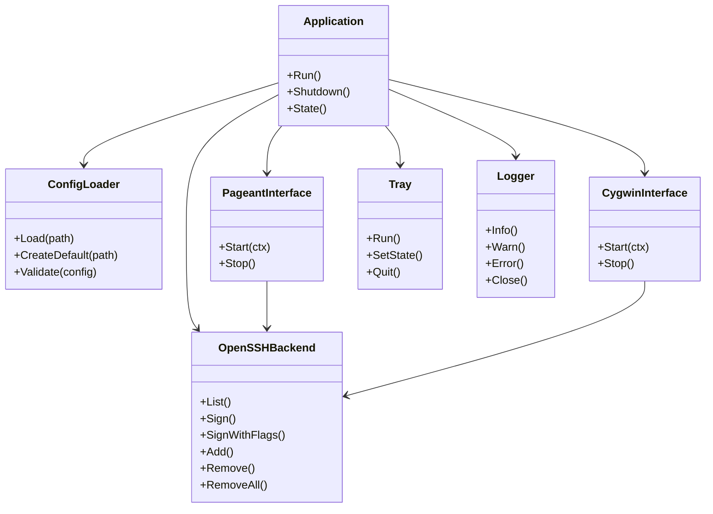

# OmniSSHAgent Windows MVP 要求仕様書

## 1. 概要

OmniSSHAgentをWindows専用の常駐SSH Agent互換ブリッジとして再構築する。

WSLとの接続およびWSL側プロセス管理はPipeferryへ完全に分離する。OmniSSHAgentはWindows上のSSH Agent環境に専念し、デフォルトではWindows OpenSSH Agentをバックエンドとして利用する。

MVPではGUIを実装せず、次の構成に限定する。

- Windowsタスクトレイへ常駐
- TOML設定ファイルによる構成管理
- Windows OpenSSH Agentをバックエンドとして利用
- Pageant互換インターフェースを提供
- CygwinおよびMSYS2互換インターフェースを提供
- 安全な終了処理
- 多重起動防止
- ファイルログ

## 2. 目的

Windowsでは、アプリケーションごとに利用するSSH Agentインターフェースが異なる。

代表的なインターフェースは次のとおり。

- Windows OpenSSH Agent Named Pipe
- PuTTY Pageant共有メモリ
- CygwinおよびMSYS2互換ソケット
- WSLのUnix Domain Socket

本MVPではWindows OpenSSH Agentを単一のバックエンドとし、PageantとCygwin/MSYS2のクライアントから利用できるように変換する。

WSLについてはPipeferryがWindows OpenSSH Agentへ直接接続するため、OmniSSHAgentはWSL用ソケットやWSL用プロキシを提供しない。

```text
Windows OpenSSH Agent
\\.\pipe\openssh-ssh-agent
          │
          ▼
    OmniSSHAgent
          │
          ├── Pageant互換インターフェース
          │
          └── Cygwin/MSYS2互換インターフェース
```

## 3. 基本方針

### 3.1 バックエンドと互換インターフェースを分離する

OmniSSHAgent内部では次の責務を分離する。

- Backend
  - SSH Agent要求を実際のSSH Agentへ転送する
- Compatibility Interface
  - PageantやCygwin固有の通信方式をSSH Agentプロトコルへ変換する
- Application
  - 設定、ライフサイクル、ログ、トレイを管理する

各互換インターフェースは、共通のSSH Agent抽象インターフェースを通してバックエンドへ接続する。

### 3.2 MVPのデフォルトバックエンド

MVPでは次をデフォルトとする。

```text
Backend type: windows-openssh
Named Pipe: \\.\pipe\openssh-ssh-agent
```

Windows OpenSSH Agentだけでなく、同じNamed Pipeを提供する1PasswordなどのSSH Agent実装も利用可能とする。

### 3.3 バックエンド接続は要求単位とする

バックエンドとのNamed Pipe接続は常時保持しない。

SSH Agent要求を受けるたびに次を行う。

1. Windows OpenSSH Agentへ接続
2. SSH Agent要求を転送
3. 応答を返す
4. 接続を閉じる

バックエンド停止後の再起動や切り替えから、自動的に回復できる構成とする。

## 4. スコープ

### 4.1 今回実装する機能

- Windows専用実行ファイル
- タスクトレイ常駐
- TOML設定ファイルの生成と読み込み
- Windows OpenSSH Agentバックエンド
- Pageant互換インターフェース
- Cygwin/MSYS2互換インターフェース
- インターフェースごとの有効化と無効化
- バックエンド接続タイムアウト
- 多重起動防止
- ログ出力
- 正常終了
- 設定エラー時の縮退起動

### 4.2 成果物

```text
OmniSSHAgent.exe
config.toml
ログファイル
READMEまたは設定リファレンス
```

### 4.3 対象環境

```text
OS: Windows 11
Architecture: x86-64
Language: Go
```

初期MVPではWindows 10、Windows on ARM、macOS、Linuxを正式な動作保証対象に含めない。

## 5. 非スコープ

初期MVPでは次を実装しない。

- Wails
- WebView2
- Web UI
- ローカルHTTP設定画面
- 鍵一覧画面
- 秘密鍵ファイルの追加と削除
- ローカル秘密鍵の読み込み
- Windows Credential Managerへのパスフレーズ保存
- 独自インメモリSSH Agent
- WSL1用Unix Domain Socket
- WSL2用プロキシ
- Pipeferryの起動や設定
- `wsl2-ssh-agent-proxy`
- `omni-socat`
- `socat`
- PowerShellによるNamed Pipeプロキシ
- OpenSSH Agentと同名のNamed Pipe再公開
- 独自Named Pipe互換インターフェース
- 設定ファイルの自動監視
- 設定のホットリロード
- Windowsログオン時の自動起動登録
- 自動アップデート
- GUIによる設定編集
- GUIによる鍵管理

これらはMVP完成後に個別の要求仕様を作成して追加する。

## 6. アプリケーション起動フロー

起動時は次の順序で処理する。

1. Windows上で実行されていることを確認
2. 名前付きMutexで多重起動を確認
3. ログ出力を初期化
4. TOML設定ファイルを探索
5. 設定ファイルが存在しなければデフォルト設定を生成
6. 設定ファイルを読み込み、検証
7. タスクトレイを起動
8. Windows OpenSSH Agentバックエンドを構築
9. 有効な互換インターフェースを起動
10. タスクトレイのメッセージループを継続

タスクトレイとPageantは、それぞれWin32メッセージループを必要とするため、専用のロック済みOSスレッドで実行する。

## 7. 多重起動防止

Windowsの名前付きMutexを使用する。

推奨Mutex名は次のとおり。

```text
Local\OmniSSHAgent
```

同じWindowsユーザーセッション内ですでにOmniSSHAgentが起動している場合、2つ目のプロセスは新しいリスナーやトレイを作成せず終了する。

Pageantの存在確認だけを多重起動判定に使用してはならない。

理由は次のとおり。

- Pageant互換インターフェースを無効化できる
- 他のPageant実装が起動している可能性がある
- OmniSSHAgent自身の多重起動判定とPageant競合判定は別問題である

## 8. 設定ファイル

### 8.1 既定パス

設定ファイルの既定パスは次とする。

```text
%APPDATA%\OmniSSHAgent\config.toml
```

Goの`os.UserConfigDir`を基準に決定する。

### 8.2 初回起動

設定ファイルが存在しない場合は、親ディレクトリを作成してデフォルト設定を書き出す。

デフォルト設定の生成に失敗した場合は、タスクトレイをエラー状態で起動し、互換インターフェースは開始しない。

### 8.3 デフォルト設定

```toml
version = 1

[backend]
type = "windows-openssh"
pipe = "openssh-ssh-agent"
connect_timeout = "5s"

[interfaces.pageant]
enabled = true

[interfaces.cygwin]
enabled = true
socket_path = ""

[tray]
show_sign_notifications = false

[logging]
level = "info"
```

### 8.4 設定項目

#### version

```toml
version = 1
```

設定スキーマのバージョン。

未対応バージョンの場合は設定エラーとする。

#### backend.type

```toml
type = "windows-openssh"
```

MVPで許可する値は`windows-openssh`のみとする。

将来、次のバックエンドを追加できる構造にする。

- local
- custom-named-pipe
- composite

ただしMVPでは実装しない。

#### backend.pipe

```toml
pipe = "openssh-ssh-agent"
```

短いNamed Pipe名または完全なNamed Pipeパスを受け付ける。

次の2つは同じ意味とする。

```toml
pipe = "openssh-ssh-agent"
```

```toml
pipe = '\\.\pipe\openssh-ssh-agent'
```

空文字列は禁止する。

#### backend.connect_timeout

```toml
connect_timeout = "5s"
```

Named Pipeへ接続する最大待機時間。

正のGo duration形式を受け付ける。

許可例:

```text
500ms
5s
30s
```

ゼロ、負数、不正な文字列は設定エラーとする。

#### interfaces.pageant.enabled

```toml
enabled = true
```

Pageant互換インターフェースを有効化する。

#### interfaces.cygwin.enabled

```toml
enabled = true
```

Cygwin/MSYS2互換インターフェースを有効化する。

#### interfaces.cygwin.socket_path

```toml
socket_path = ""
```

空文字列の場合は次を使用する。

```text
%USERPROFILE%\.ssh\omnisshagent-cygwin.sock
```

値を指定する場合はWindowsの絶対パスでなければならない。

環境変数展開やチルダ展開はMVPでは行わない。

#### tray.show_sign_notifications

```toml
show_sign_notifications = false
```

署名要求が成功したときにWindows通知を表示する。

デフォルトでは無効とする。

秘密情報、署名対象データ、完全な公開鍵を通知へ含めてはならない。

#### logging.level

```toml
level = "info"
```

許可する値は次のとおり。

```text
debug
info
warn
error
```

### 8.5 未知の設定項目

未知のトップレベルセクションと未知の設定項目は設定エラーとする。

設定ミスを黙って無視してはならない。

### 8.6 設定の反映

MVPでは設定変更のホットリロードを行わない。

設定変更はOmniSSHAgentを終了して再起動したときに反映する。

## 9. Windows OpenSSH Agentバックエンド

### 9.1 責務

バックエンドは、受け取ったSSH Agent操作をWindows OpenSSH Agentへ透過的に転送する。

最低限、次の操作を扱う。

- List
- Sign
- SignWithFlags
- Add
- Remove
- RemoveAll
- Lock
- Unlock
- Extension

バックエンドが対応していない操作は、そのエラーを互換インターフェースへ返す。

### 9.2 接続回復

バックエンドが起動していない場合でもOmniSSHAgent本体を終了しない。

要求時の接続に失敗した場合は、その要求だけを失敗させてログへ記録する。

Windows OpenSSH Agentが後から起動した場合、次の要求から自動的に利用可能になること。

### 9.3 ペイロード

SSH Agent要求、署名対象データ、秘密鍵、パスフレーズをログへ出力してはならない。

## 10. Pageant互換インターフェース

### 10.1 目的

PuTTY、WinSCP、TortoiseGitなど、Pageant互換インターフェースを利用するWindowsアプリケーションからWindows OpenSSH Agentを利用可能にする。

### 10.2 動作

- Pageant互換Window Classを作成する
- `WM_COPYDATA`を受信する
- 共有メモリからSSH Agent要求を読み取る
- 共通バックエンドへ要求を転送する
- 応答を共有メモリへ書き戻す
- ペイロードを独自に変更しない

### 10.3 スレッド

PageantのWin32 Windowとメッセージループは専用OSスレッドで実行する。

`runtime.LockOSThread`相当の制御を使用する。

### 10.4 競合

別のPageant互換アプリケーションがすでにPageant Window Classを所有している場合、Pageant互換インターフェースの起動は失敗として扱う。

この場合も次を満たすこと。

- OmniSSHAgent本体は終了しない
- Cygwin/MSYS2互換インターフェースは継続する
- タスクトレイは継続する
- 競合をログへ記録する
- タスクトレイの状態をDegradedにする

## 11. Cygwin/MSYS2互換インターフェース

### 11.1 目的

Cygwin、MSYS2、Git for Windowsなど、Cygwin互換SSH Agentソケットを利用するアプリケーションからWindows OpenSSH Agentを利用可能にする。

### 11.2 動作

- `127.0.0.1`のランダムポートでTCPリスナーを開始する
- Cygwin互換ソケットファイルを生成する
- 接続時にnonceによるハンドシェイクを行う
- ハンドシェイク成功後にSSH Agent要求を転送する
- 外部インターフェースへバインドしない

### 11.3 ソケットファイル

既定値は次とする。

```text
%USERPROFILE%\.ssh\omnisshagent-cygwin.sock
```

起動時に同名パスが存在する場合は安全性を確認する。

次の対象を無条件に削除してはならない。

- ディレクトリ
- 通常のユーザーファイル
- OmniSSHAgentが生成したと確認できないファイル
- 別プロセスが使用中の有効なCygwinソケット

安全に削除できない場合は、Cygwin互換インターフェースだけを起動失敗とする。

### 11.4 終了時

OmniSSHAgent自身が作成したソケットファイルだけを削除する。

読み取り専用属性やSYSTEM属性を設定した場合は、削除前に必要な属性解除を行う。

### 11.5 障害分離

Cygwin互換インターフェースが起動できない場合でも、Pageant互換インターフェースとタスクトレイは継続する。

## 12. タスクトレイ

### 12.1 目的

GUIを実装しないMVPで、常駐状態の確認、設定ファイルへのアクセス、終了操作を提供する。

### 12.2 表示

タスクトレイにOmniSSHAgentアイコンを表示する。

ツールチップには最低限、次のいずれかの状態を表示する。

```text
OmniSSHAgent - Running
OmniSSHAgent - Degraded
OmniSSHAgent - Configuration error
```

### 12.3 メニュー

最低限、次のメニューを提供する。

```text
Status: Running
Open configuration
Open configuration directory
Open log directory
Quit
```

`Status`は選択できない表示項目とする。

設定変更後の再起動は、ユーザーが`Quit`して再度起動する。

### 12.4 Open configuration

`Open configuration`は、既定の関連付けアプリケーションで`config.toml`を開く。

設定ファイルが存在しない場合は生成を試みる。

### 12.5 Quit

`Quit`はアプリケーション全体の正常終了を開始する。

強制終了を即座に実行してはならない。

## 13. アプリケーション状態

内部状態は最低限、次の3種類とする。

### Running

- 設定ファイルが正常
- 有効化された互換インターフェースがすべて起動済み
- バックエンド設定が有効

バックエンドへの接続は要求時に行うため、Windows OpenSSH Agentが一時的に停止していても、アプリケーション状態を即座にDegradedへ変更する必要はない。

### Degraded

- 設定は正常
- 一部の互換インターフェースが起動できない
- 他の互換インターフェースは利用可能

例:

- Pageant競合
- Cygwinソケットファイル競合
- 一部リスナーの起動失敗

### Configuration error

- TOMLの構文エラー
- 未知の設定項目
- 未対応の設定バージョン
- 不正なパス
- 不正なタイムアウト値

この状態では互換インターフェースを起動しない。

タスクトレイ、ログ、設定ファイルを開く機能、終了機能は利用可能とする。

## 14. ログ

### 14.1 既定ログディレクトリ

```text
%LOCALAPPDATA%\OmniSSHAgent\logs
```

### 14.2 ファイル名

```text
omnisshagent-YYYYMMDD.log
```

### 14.3 ログ対象

最低限、次を記録する。

- アプリケーション起動
- バージョン
- 設定ファイルパス
- 設定読み込み成功または失敗
- 各互換インターフェースの起動結果
- バックエンド接続失敗
- Pageant競合
- Cygwinソケット競合
- 正常終了開始
- 終了完了
- 予期しないエラー

### 14.4 ログ禁止情報

次をログへ出力してはならない。

- 秘密鍵
- パスフレーズ
- 署名対象データ
- SSH Agentの完全なバイナリペイロード
- Windows Credential Managerの値
- 環境変数全体
- 不要な個人情報

### 14.5 ローテーション

MVPでは最低限、日付単位でログファイルを分割する。

保持期間や容量制限による削除は後続機能とする。

## 15. 終了処理

終了時は次の順序で処理する。

1. 多重終了を防止する
2. 新規要求の受付を停止
3. 共通の`context.Context`をキャンセル
4. Pageantメッセージループへ終了通知
5. Cygwinリスナーを閉じる
6. Cygwinソケットファイルを削除
7. タスクトレイへ終了通知
8. すべてのゴルーチンとOSスレッドの終了を待つ
9. 名前付きMutexを解放
10. ログをフラッシュして閉じる
11. プロセスを終了

終了待機には上限時間を設ける。

既定値は次を推奨する。

```text
10s
```

上限を超えた場合は、残存コンポーネントをログへ記録して終了する。

## 16. CLI

GUIを持たないMVPの診断用として、最低限のCLIを提供する。

### 16.1 通常起動

```powershell
OmniSSHAgent.exe
```

タスクトレイ常駐モードで起動する。

### 16.2 version

```powershell
OmniSSHAgent.exe version
OmniSSHAgent.exe --version
```

最低限、次を表示する。

```text
Version
Commit
Build time
GOOS
GOARCH
```

### 16.3 check-config

```powershell
OmniSSHAgent.exe check-config
OmniSSHAgent.exe check-config --config C:\path\to\config.toml
```

設定ファイルを読み込み、検証だけ行って終了する。

正常時は終了コード0とする。

異常時はエラー位置と理由を標準エラーへ表示する。

### 16.4 config-path

```powershell
OmniSSHAgent.exe config-path
```

既定の設定ファイルパスを標準出力へ表示する。

## 17. 終了コード

```text
0  正常終了
1  内部エラー
2  CLI引数エラー
3  設定ファイルエラー
4  多重起動
5  バックエンド設定エラー
6  互換インターフェース起動エラー
7  Windows専用機能の初期化エラー
```

通常のタスクトレイ起動では、一部の互換インターフェース起動失敗を理由に直ちにプロセス終了しない。

終了コード6は、診断コマンドやすべての有効インターフェースが起動不能な場合に使用する。

## 18. セキュリティ要件

- Cygwin互換TCPリスナーは`127.0.0.1`のみにバインドする
- Named Pipeパスをログへ出力する場合も、秘密情報を含まないこと
- バックエンドとのSSH Agentペイロードを保存しない
- 設定ファイルに秘密鍵やパスフレーズを保存しない
- 任意コマンド実行機能を持たせない
- 任意DLLやプラグイン読み込み機能を持たせない
- 生成ファイルは現在ユーザーだけが変更できる場所へ保存する
- Cygwinソケットファイルを削除する前に種類と所有状態を確認する
- Pageant共有メモリのサイズを検証する
- SSH Agentメッセージ長に上限を設定する
- 不正なメッセージでプロセス全体がパニックしないこと

## 19. 推奨構成

```text
OmniSSHAgent
├── cmd
│   └── omnisshagent
│       └── main_windows.go
├── internal
│   ├── app
│   │   ├── application.go
│   │   ├── lifecycle.go
│   │   └── state.go
│   ├── backend
│   │   ├── backend.go
│   │   └── openssh
│   │       └── client_windows.go
│   ├── config
│   │   ├── config.go
│   │   ├── defaults.go
│   │   └── validate.go
│   ├── interfaces
│   │   ├── interface.go
│   │   ├── pageant
│   │   └── cygwin
│   ├── logging
│   ├── singleton
│   └── tray
├── build
│   └── windows
├── docs
└── go.mod
```

既存パッケージを再利用する場合も、外部から見た責務がこの構成に沿うよう整理する。

## 20. 削除または移動する既存機能

OmniSSHAgentリポジトリから次のWSL関連実装を削除するか、履歴参照用に廃止扱いとする。

```text
cmd/wsl2-ssh-agent-proxy
cmd/omni-socat
pkg/npipe2stdin
pkg/unix
WSLセットアップ用hackスクリプト
PowerShell Named Pipeプロキシ
WSL向けドキュメント
```

READMEのWSL利用手順はPipeferryへのリンクへ置き換える。

例:

```text
WSL integration is provided by Pipeferry.
See https://github.com/masahide/pipeferry/blob/main/docs/openssh-agent.md
```

Cygwin/MSYS2対応はWindows互換インターフェースとして残す。

## 21. 受け入れ条件

### AC-01 初回起動

Given 設定ファイルが存在しない  
When OmniSSHAgentを起動する  
Then デフォルトの`config.toml`が生成され、タスクトレイへ常駐する。

### AC-02 デフォルトバックエンド

Given デフォルト設定で起動している  
When PageantまたはCygwin互換クライアントが鍵一覧を要求する  
Then `\\.\pipe\openssh-ssh-agent`へ要求が転送される。

### AC-03 Pageant互換

Given Windows OpenSSH Agentに鍵が登録されている  
When Pageant互換クライアントが鍵一覧または署名を要求する  
Then Windows OpenSSH Agentの応答を受け取れる。

### AC-04 Cygwin/MSYS2互換

Given Cygwin互換インターフェースが有効である  
When Git for WindowsまたはMSYS2のSSHクライアントが生成されたソケットを利用する  
Then Windows OpenSSH Agentの鍵一覧取得と署名が成功する。

### AC-05 バックエンド未起動

Given Windows OpenSSH Agentが停止している  
When 互換クライアントが要求する  
Then その要求だけが失敗し、OmniSSHAgent本体は常駐を継続する。

### AC-06 バックエンド回復

Given Windows OpenSSH Agent停止中に要求が失敗した  
When Windows OpenSSH Agentを起動して再度要求する  
Then OmniSSHAgentを再起動せず要求が成功する。

### AC-07 インターフェース障害分離

Given Pageant互換インターフェースが競合している  
When OmniSSHAgentを起動する  
Then Cygwin互換インターフェースとタスクトレイは継続し、状態はDegradedになる。

### AC-08 設定エラー

Given `config.toml`に構文エラーがある  
When OmniSSHAgentを起動する  
Then互換インターフェースは起動せず、タスクトレイから設定ファイルとログを開ける。

### AC-09 多重起動

Given OmniSSHAgentがすでに起動している  
When 2つ目のOmniSSHAgentを起動する  
Then 2つ目は新しいトレイやリスナーを作成せず終了する。

### AC-10 正常終了

Given PageantおよびCygwin互換インターフェースが稼働中である  
When タスクトレイの`Quit`を選択する  
Then すべてのリスナーとメッセージループが終了し、Cygwinソケットが削除され、プロセスが終了する。

### AC-11 WSL分離

Given OmniSSHAgent MVPをビルドする  
When成果物と依存関係を確認する  
Then WSLプロキシ、WSL Unix Socket、Pipeferry起動処理、PowerShellプロキシを含まない。

## 22. 完了の定義

### 22.1 機能完了

- Windows OpenSSH Agentをバックエンドとして利用できる
- Pageant互換インターフェースが動作する
- Cygwin/MSYS2互換インターフェースが動作する
- TOML設定で各インターフェースを有効化または無効化できる
- タスクトレイから状態確認、設定ファイル表示、ログ表示、終了ができる
- 多重起動が防止される
- 終了時にリソースが解放される

### 22.2 品質完了

- 設定読み込みと検証の単体テストがある
- OpenSSH Agentバックエンドの接続失敗と回復をテストしている
- Pageant要求転送のテストがある
- Cygwinハンドシェイクと要求転送のテストがある
- タイムアウトとキャンセルのテストがある
- 競合時の障害分離をテストしている
- Windows実機でPageant互換クライアントを使ったE2E確認を行っている
- Windows実機でGit for WindowsまたはMSYS2を使ったE2E確認を行っている
- `go test ./...`が成功する
- `go vet ./...`が成功する
- Wails、WebView2、Node.js、Svelteへの依存が残っていない
- WSL関連コードがMVPのビルド対象に含まれていない

## 23. 将来拡張

MVP後に検討する機能は次のとおり。

- ローカル秘密鍵バックエンド
- Windows Credential Manager連携
- Web UI
- ローカルHTTP設定画面
- Windows標準ファイル選択ダイアログ
- 設定ホットリロード
- タスクトレイからの再読み込み
- Windowsログオン時の自動起動
- インストーラー
- Authenticode署名
- OpenSSH Named Pipe以外のカスタムバックエンド
- 複数バックエンドの統合
- 署名利用通知
- 状態診断CLI
- 自動アップデート

## 24. 参考となる責務分離


